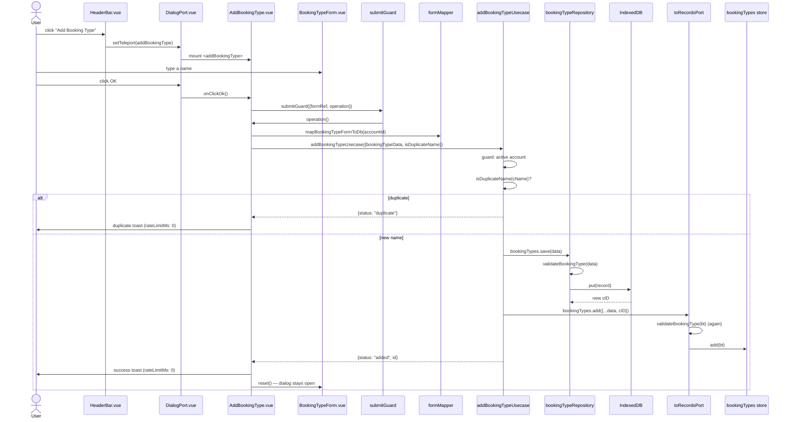

# Add Booking Type — File-by-File Walkthrough

This document traces what happens, file by file, when a user adds a booking type. A
booking type is an account-scoped label (e.g. "Buy", "Fee") that categorizes bookings; a **role** (`cRole`: `buy`/
`sell`/`dividend`/`other`) is what portfolio, invest, and
dividend calculations actually key off, independent of the label's text.

See also: [Edit Booking Type](edit-booking-type.md) · [Delete Booking Type](delete-booking-type.md)

## Quick file map

| Layer                  | File                                                                                                          | Role                                                                                 |
|------------------------|---------------------------------------------------------------------------------------------------------------|--------------------------------------------------------------------------------------|
| Entry point            | `/src/adapters/ui/views/HeaderBar.vue`                                                                        | Renders the **Manage Booking Types → Add** toolbar button                            |
| Action wiring          | `/src/adapters/ui/composables/useHeaderBarActions.ts`                                                         | Guards on `records.hasActiveAccount`, then opens the dialog                          |
| Dialog registration    | `/src/adapters/ui/plugins/components.ts`                                                                      | Maps `"addBookingType"` to `AddBookingType.vue`                                      |
| Dialog component       | `/src/adapters/ui/components/dialogs/AddBookingType.vue`                                                      | Builds the payload, checks for a duplicate name, calls the usecase                   |
| Form fields            | `/src/adapters/ui/components/dialogs/forms/BookingTypeForm.vue`                                               | A single name field in `mode="add"` — no role control                                |
| Form state             | `/src/adapters/ui/composables/useForms.ts` (`createBookingTypeFormManager`)                                   | Reactive `bookingTypeFormData`, seeded `role: BOOKING_TYPE_ROLE.OTHER`               |
| Field-level validation | `/src/adapters/ui/validationAdapter.ts` (`nameRules`)                                                         | Required, length, and "must not begin with…" checks                                  |
| Duplicate check        | `/src/domain/validation/duplicates.ts` (`isDuplicateBookingTypeName`), via `records.bookingTypes.isDuplicate` | Case-insensitive, trim/whitespace-collapsed name comparison — **not** a Vuetify rule |
| Form → DB mapping      | `/src/domain/mapping/formMapper.ts` (`mapBookingTypeFormToDb`)                                                | Normalizes the name (`normalizeBookingTypeName`), attaches the account id            |
| Usecase                | `/src/app/usecases/bookingTypes.ts` (`addBookingTypeUsecase`)                                                 | Active-account guard, duplicate check, persist, update the store                     |
| Repository             | `/src/adapters/driven/database/repositories/bookingTypeRepository.ts`                                         | Persists to IndexedDB                                                                |
| Record validation      | `/src/domain/validation/validators.ts` (`validateBookingType`)                                                | Normalizes/whitelists the record                                                     |
| Pinia store            | `/src/adapters/ui/stores/bookingTypes.ts` (`useBookingTypesStore`)                                            | In-memory reactive booking type list                                                 |

## Step by step

### 1. Opening the dialog

`HeaderBar.vue`'s **Add Booking Type** entry dispatches to `useHeaderBarActions.ts`'s
`addBookingType`:

```ts
addBookingType: async () => {
    if (!records.hasActiveAccount) {
        await alertAdapter.feedbackInfo(t("views.headerBar.infoTitle"), t("views.headerBar.messages.noAccount"));
    } else {
        openDialog("addBookingType");
    }
},
```

### 2. The form — `BookingTypeForm.vue` in `mode="add"`

With `props.mode === "add"`, the account-selector `v-select` (used by update/delete to *choose* an existing type) is not
rendered at all — only the name `v-text-field` shows,
autofocused, with `validationAdapter.nameRules`. There is **no role control anywhere in
this form**: every type created here is stamped `cRole: BOOKING_TYPE_ROLE.OTHER` by
`createBookingTypeFormManager`'s initial data and never changed by this dialog. The only
way an account gets a `buy`/`sell`/`dividend`-role type is the default set
`createDefaultBookingTypes` seeds when a depot account is created or `withDepot` is
switched on (see [Add Account](add-account.md) / [Edit Account](edit-account.md)) — there
is no dialog to *promote* a custom type to one of those roles after the fact (see
[Delete Booking Type](delete-booking-type.md) for why that matters).

### 3. Clicking OK

```ts
const bookingTypeData = mapBookingTypeFormToDb(activeAccountId.value);
const res = await addBookingTypeUsecase(
    {repositories, records: toRecordsPort(records)},
    {bookingTypeData, isDuplicateName: (name) => records.bookingTypes.isDuplicate(name)}
);

if (res.status === "duplicate") {
    await alertAdapter.feedbackInfo(t(...), t("components.dialogs.addBookingType.messages.duplicate"), {rateLimitMs: 0});
    return;
}

await alertAdapter.feedbackInfo(t(...), t("components.dialogs.addBookingType.messages.success"), {rateLimitMs: 0});
reset();
```

`isDuplicateName` is passed in as a **caller-supplied predicate**, not baked into the
usecase — the store's own case-insensitive, trim/whitespace-collapsed check (`isDuplicateBookingTypeName`), not a
`validationAdapter.*` Vuetify rule the way
`ibanRules`' duplicate check is for accounts. Both `rateLimitMs: 0` calls exist for the
same reason as [Add Booking](add-booking.md) §9: this dialog also clears its form and
stays open for repeated entry, and every message here is a fixed string, so without it
the alert adapter's default de-duplication window would swallow the second of two
consecutive outcomes (e.g. "success" then a would-be "duplicate" on a same-named retry).

### 4. The usecase — `addBookingTypeUsecase`

`/src/app/usecases/bookingTypes.ts`'s `addBookingTypeUsecase`:

1. **Guard: active account.** Rejects (`xx_no_active_account`) unless
   `cAccountNumberID` is a positive integer — the same guard, for the same
   export-blocking-orphan reason, as `addBookingUsecase` and `addStockUsecase` (see
   [Add Booking](add-booking.md) §6).
2. **Duplicate check.** Calls the supplied `isDuplicateName(cName)` and returns
   `{status: "duplicate"}` **without writing anything** if it matches — checked *before*
   the repository write, unlike the account-guard-driven errors elsewhere, which throw.
3. **Persist**: `repositories.bookingTypes.save(bookingTypeData)`.
4. **Update the store**: `records.bookingTypes.add({...bookingTypeData, cID: id})`.

No `runtime.resetTeleport()` and no `runtime.clearStocksPages()` here — a brand-new
`other`-role type changes nothing about existing bookings' role resolution, and the
dialog stays open by design (step 3's `reset()`), same pattern as
[Add Booking](add-booking.md).

### 5. Persisting and store consistency

`bookingTypeRepository.ts`'s `save` runs `validateBookingType` (whitelists/normalizes,
falls back to `resolveLegacyBookingTypeRole` for a `cRole` it can't recognize) before the
IndexedDB write — see `/src/domain/validation/validators.ts`. `toRecordsPort` wraps the
store's `add`/`update` with the same validator a second time, for the identical
DB/store-consistency reason documented in [Add Booking](add-booking.md) §8.

## Sequence diagram



## Related documents

- [Edit Booking Type](edit-booking-type.md) · [Delete Booking Type](delete-booking-type.md)
- [Add Account](add-account.md) — `createDefaultBookingTypes`, the only source of a `buy`/`sell`/`dividend`-role type
- [`/src/app/usecases/README.md`](/src/app/usecases/README.md) §4.1
- `/tests/e2e/dialog-actions.spec.ts` — `addBookingType: creates a new booking type`
