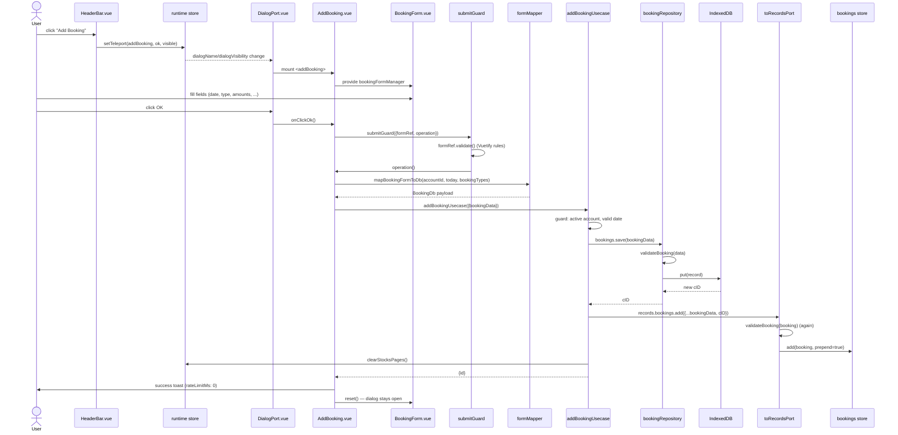

# Add Booking — File-by-File Walkthrough

This document traces everything that happens, file by file, when a user adds a booking (transaction) in KontenManager.
It is the detailed companion to the short summary in
[`/src/app/usecases/README.md`](/src/app/usecases/README.md) §3.1 — that section is the
one-paragraph version; this one opens every file it only names.

See also: [Edit Booking](edit-booking.md) · [Delete Booking](delete-booking.md)

## Quick file map

| Layer                  | File                                                                    | Role                                                                                                |
|------------------------|-------------------------------------------------------------------------|-----------------------------------------------------------------------------------------------------|
| Entry point            | `/src/adapters/ui/views/HeaderBar.vue`                                  | Renders the **Add Booking** toolbar button                                                          |
| Action wiring          | `/src/adapters/ui/composables/useHeaderBarActions.ts`                   | Guards on an active account, then opens the dialog                                                  |
| Dialog state           | `/src/adapters/ui/stores/runtime.ts`                                    | Holds `dialogName` / `dialogOk` / `dialogVisibility`                                                |
| Dialog host            | `/src/adapters/ui/components/DialogPort.vue`                            | Teleports the named dialog component into a `v-dialog`, owns the OK/Cancel buttons                  |
| Dialog registration    | `/src/adapters/ui/plugins/components.ts`                                | Maps the string `"addBooking"` to the `AddBooking.vue` component                                    |
| Dialog component       | `/src/adapters/ui/components/dialogs/AddBooking.vue`                    | Orchestrates the save: builds the DB payload, calls the usecase, shows feedback, resets the form    |
| Form shell             | `/src/adapters/ui/components/dialogs/forms/BaseDialogForm.vue`          | Wraps the `<v-form>`, exposes `formRef` for validation                                              |
| Form fields            | `/src/adapters/ui/components/dialogs/forms/BookingForm.vue`             | The actual input fields, shown/hidden by the selected booking type's role                           |
| Form state             | `/src/adapters/ui/composables/useForms.ts` (`createBookingFormManager`) | Reactive `bookingFormData`, provided/injected via Vue's DI                                          |
| Field-level validation | `/src/adapters/ui/validationAdapter.ts`                                 | Vuetify rule arrays (`isoDateRules`, `bookingTypeRules`, `stockRules`, `countRules`, `amountRules`) |
| Submit orchestration   | `/src/adapters/ui/composables/useDialogGuards.ts` (`submitGuard`)       | Validates the form, checks the DB connection, runs the operation, handles errors                    |
| Form → DB mapping      | `/src/domain/mapping/formMapper.ts` (`mapBookingFormToDb`)              | Converts form fields into a `BookingDb` record, zeroing role-inappropriate fields                   |
| Usecase                | `/src/app/usecases/bookings.ts` (`addBookingUsecase`)                   | Domain guards, persists, updates the store, triggers dependent recalculation                        |
| Port adapter           | `/src/app/usecases/portAdapters.ts` (`toRecordsPort`)                   | Re-validates before writing into the Pinia store, so DB and store can't disagree                    |
| Repository             | `/src/adapters/driven/database/repositories/bookingRepository.ts`       | Persists to IndexedDB                                                                               |
| Record validation      | `/src/domain/validation/validators.ts` (`validateBooking`)              | Normalizes/whitelists the record on the way into IndexedDB and into the store                       |
| Pinia store            | `/src/adapters/ui/stores/bookings.ts` (`useBookingsStore`)              | In-memory reactive booking list; portfolio/accounting figures derive from it                        |

## Step by step

### 1. Opening the dialog

The user clicks **Add Booking** in `HeaderBar.vue`, which calls
`useHeaderBarActions.ts`'s `onIconClick`, dispatching to the `addBooking` entry of
`dialogActions`:

```ts
addBooking: async () => {
    if (!records.hasActiveAccount) {
        await alertAdapter.feedbackInfo(t("views.headerBar.infoTitle"), t("views.headerBar.messages.noAccount"));
    } else {
        openDialog("addBooking");
    }
},
```

`openDialog` calls `runtime.setTeleport({dialogName: "addBooking", dialogOk: true, dialogVisibility: true})`.
`DialogPort.vue` — mounted once, near the app root — reads those three refs and renders

```html
<component :is="runtime.dialogName" ref="dialogRef"/>
```

inside a `v-dialog`. `runtime.dialogName` is the string `"addBooking"`, which resolves to
the `AddBooking.vue` component because `components.ts` registered it globally under that
exact name (`app.component("addBooking", AddBooking)`).

### 2. Mounting `AddBooking.vue`

On mount, `AddBooking.vue`:

- creates a fresh `createBookingFormManager()` (from `useForms.ts`) — a small reactive
  object (`bookingFormData`) seeded with blank/zero defaults, plus `mapBookingFormToDb`
  and `reset`
- `provide`s it (`provideBookingFormManager`) so the injected `BookingForm.vue` child can
  read/write the same reactive object without prop drilling
- calls `reset()` in `onBeforeMount`, in case the dialog is being reopened after a
  previous save (see step 6 — this dialog stays open after a successful save)
- `defineExpose`s `{onClickOk, title, isLoading}` — this is what `DialogPort.vue`'s
  template ref (`dialogRef`) actually calls when the user clicks the OK button

### 3. Filling the form — `BookingForm.vue`

`BookingForm.vue` injects the same form manager via `useBookingForm()` and binds every
field to `bookingFormData.*`. Which fields are visible depends entirely on the **role**
(`cRole`) of the currently selected booking type, resolved from
`recordsStore.bookingTypes.items`:

| Role       | Extra fields shown                                             |
|------------|----------------------------------------------------------------|
| `BUY`      | stock, count, market place, fee, transaction tax               |
| `SELL`     | stock, count, market place, fee, tax, soli, source tax         |
| `DIVIDEND` | stock, count, ex-date, tax, soli, source tax                   |
| `OTHER`    | none of the above — just date, type, credit/debit, description |

Each visible field carries a Vuetify `:rules` array built by `validationAdapter.ts`:

- `isoDateRules` — date and (for dividends) ex-date
- `bookingTypeRules` / `stockRules` — reject the placeholder `0`/`-1` sentinel rows
- `countRules` — share count must be a real number `> 0`
- `amountRules` (via `CreditDebitFieldset.vue`'s `oneOfTwo`) — exactly one side of each
  credit/debit pair may be non-zero

`countRules` carries a long comment worth knowing about: Vuetify's `v-text-field
type="number"` hands rules the **raw string** the user typed, not a coerced number (`v-model.number` is inert on
`VTextField`). The rule accepts both a `number` and a
numeric `string` for exactly that reason — an earlier version that only accepted
`typeof v === "number"` rejected every share count a user actually typed, silently
disabling the OK button for every Buy/Sell/Dividend booking (see the round-43 note in
that file and in the audit memory).

### 4. Clicking OK

`DialogPort.vue`'s OK button calls `dialogRef.onClickOk` — i.e. `AddBooking.vue`'s
`onClickOk`, which delegates the whole flow to `useDialogGuards.ts`'s `submitGuard`:

```ts
await submitGuard({
    formRef: baseDialogRef.value?.formRef,
    isConnected: databaseAdapter.isConnected(),
    connectionErrorMessage: browserAdapter.getMessage("xx_db_connection_err"),
    showSystemNotification: alertAdapter.feedbackInfo,
    errorContext: "ADD_BOOKING",
    errorTitle: t("components.dialogs.onClickOk"),
    operation: async () => { /* step 5 */ }
});
```

`submitGuard`:

1. Guards against re-entrancy (`isLoading`) and wraps everything in `withLoading` so the
   OK button is disabled for the whole flow, not just the DB write.
2. Runs `formRef.validate()` (Vuetify's own form validation, triggering every rule from
   step 3). **Fail-closed**: a `null`/missing `formRef` is treated as invalid, not as
   "nothing to validate" — a dialog that genuinely has no form must say so explicitly via
   `skipValidation`.
3. On an invalid form, shows a warning and returns — `operation` never runs.
4. Checks `databaseAdapter.isConnected()`; shows a connection error and returns if not.
5. Runs `operation()` (step 5) inside a `try/catch`, routing any thrown error to
   `alertAdapter.feedbackError`.

### 5. Building the DB payload — `formMapper.ts`

Inside `operation`, `AddBooking.vue` calls:

```ts
const bookingData = mapBookingFormToDb(activeAccountId.value, DATE.ISO, records.bookingTypes.items);
```

`mapBookingFormToDb` (in `/src/domain/mapping/formMapper.ts`) turns the flat
`bookingFormData` into a `BookingDb`-shaped object:

- resolves the selected booking type's role once (`roleOf`), then uses it to decide,
  field by field, whether a value is kept or zeroed — mirroring `BookingForm.vue`'s own
  visibility gates exactly, so a value left over from a previously-selected type's now
  hidden field can never sneak into the saved record (e.g. `cFee` is only non-zero for
  `BUY`/`SELL`, `cTransactionTax` only for `BUY`, `cStockID`/`cCount` only for
  stock-related types)
- collapses each credit/debit pair into one signed field (`debit - credit`)
- coerces `data.count` through `toNumber()` before it reaches `cCount` — `count` is typed
  `number` but, for the same Vuetify reason as `countRules` above, actually holds a **string** at runtime; without this
  coercion a later `acc + entry.cCount` in the
  portfolio math would silently string-concatenate instead of add (`100 + "10" ->
  "10010"`) until the next full reload
- sets `cExDate` from the form only for dividends, otherwise to the supplied
  `defaultISODate` (`DATE.ISO`, i.e. today)

The result has no `cID` yet (`Omit<BookingDb, "cID">`) — that's assigned by IndexedDB on
insert.

### 6. The usecase — `addBookingUsecase`

```ts
await addBookingUsecase(
    {repositories, records: toRecordsPort(records), runtime},
    {bookingData}
);
```

`/src/app/usecases/bookings.ts`'s `addBookingUsecase`:

1. **Guard: active account.** Rejects (`xx_no_active_account`) unless
   `cAccountNumberID` is a positive integer. Without this, a booking with no account
   could still be written, and — because `exportDatabaseUsecase`'s consistency check
   refuses to export a database containing any orphaned booking, and nothing in the UI
   can remove one — that single row would permanently block every future export.
2. **Guard: valid book date.** Rejects (`xx_blank_book_date`) unless `cBookDate` passes
   `isValidISODate`. `validateBooking` (next step) intentionally does *not* reject a
   blank date itself — that leniency exists for imports, where inventing a date would be
   worse than leaving it blank — but on the add path there is a user who can supply the
   real date, so the usecase enforces it here instead.
3. **Persist**: `repositories.bookings.save(bookingData)` — see step 7.
4. **Update the store**: `records.bookings.add({...bookingData, cID: addBookingID}, true)`
   (prepend, so the newest booking is first).
5. **Invalidate dependent state**: `runtime.clearStocksPages()` — a new booking changes a
   stock's holdings (FIFO portfolio math), which is the secondary sort key behind stock
   table paging.
6. Deliberately does **not** call `runtime.resetTeleport()` — unlike every other
   add/update usecase. `AddBooking.vue` keeps the dialog open and just clears the form (step 8), because bookings are
   typically entered several at a time.

### 7. Persisting — `bookingRepository.ts` and `validateBooking`

`bookingRepository.ts`'s `save`:

```ts
async function save(data: BookingDb | Omit<BookingDb, "cID">, options = {}): Promise<number> {
    return base.save(validateBooking(data), options);
}
```

`validateBooking` (`/src/domain/validation/validators.ts`) rebuilds the record field by
field from an explicit `cXxx` whitelist before it ever reaches IndexedDB:

- normalizes `cBookDate`/`cExDate` (`normalizeDate` — invalid input becomes `""`, never a
  guessed "today")
- rounds every money field to 2 decimals (`round2(normalizeAmount(...))`) — `cCount` is
  normalized but deliberately **not** rounded, since it can be a fractional fund share
  count
- collapses legacy pre-schema-30 Credit/Debit pairs if present (`normalizeSignedAmount`)
  — relevant for imported backups, not for a freshly-filled form
- logs a warning (does not throw) if `cAccountNumberID` is `0` — the usecase's own guard
  in step 6 is what actually blocks the save; this is a secondary log-only check that
  predates it and remains for the import path

`base.save` (the shared `baseRepository.ts` logic) then performs the actual IndexedDB
`put`/`add` and returns the new `cID`.

### 8. Store consistency — `toRecordsPort` and `useBookingsStore`

Back in the usecase, `records.bookings.add(...)` is not a direct call into the Pinia
store — `records` was wrapped by `toRecordsPort` (`/src/app/usecases/portAdapters.ts`)
before being passed in:

```ts
bookings: {
    add: (booking, prepend) => records.bookings.add(validateBooking(booking), prepend),
    ...
}
```

This runs `validateBooking` a **second** time, on the way into the store. That
duplication is deliberate: the repository validates on the way into IndexedDB, but a
usecase that forgot to also normalize before updating the store would let the DB and the
in-memory store disagree until the next reload — which is exactly how the string-`cCount`
bug from step 5 first surfaced before it was fixed in two places.

`useBookingsStore.add` (`/src/adapters/ui/stores/bookings.ts`) then just prepends the
validated record into its reactive `items` array. Every computed aggregate that depends
on bookings — `sumBookings`, `portfolioByStockId`, `investByStockId`,
`dividendsByStockId`, `bookedYears`, and so on — recomputes automatically from there via
Vue reactivity; nothing about the add flow calls them directly.

### 9. Feedback and reset

Back in `AddBooking.vue`, after `addBookingUsecase` resolves:

```ts
await alertAdapter.feedbackInfo(
    t("components.dialogs.addBooking.title"),
    t("components.dialogs.addBooking.messages.success"),
    {rateLimitMs: 0}
);
reset();
```

`rateLimitMs: 0` deliberately bypasses the alert adapter's default 1.5 s de-duplication
window — without it, two bookings saved back to back (the exact repeated-entry scenario
this dialog is built for) would show only one confirmation, giving no signal that the
second write actually landed. `reset()` clears `bookingFormData` back to its initial
blank/zero state; the dialog itself stays open (there is no `resetTeleport()` anywhere in
this path) so the user can immediately enter the next booking.

If `operation` throws instead (a guard rejection from step 6, or any other error),
`submitGuard`'s `catch` routes it to `alertAdapter.feedbackError` and the dialog stays
open with the form untouched — nothing is reset on failure.

## Sequence diagram



## Related documents

- [Edit Booking](edit-booking.md) · [Delete Booking](delete-booking.md)
- [`/src/app/usecases/README.md`](/src/app/usecases/README.md) — the short version of this
  flow (§3.1), plus every other workflow in the app and the e2e coverage table
- [`/src/README.md`](/src/README.md) — overall architecture (adapters/app/domain layering)
- `/tests/e2e/dialog-actions.spec.ts` — end-to-end coverage:
  `addBooking: creates a new booking against the fixture's BUY type and AAPL stock`
