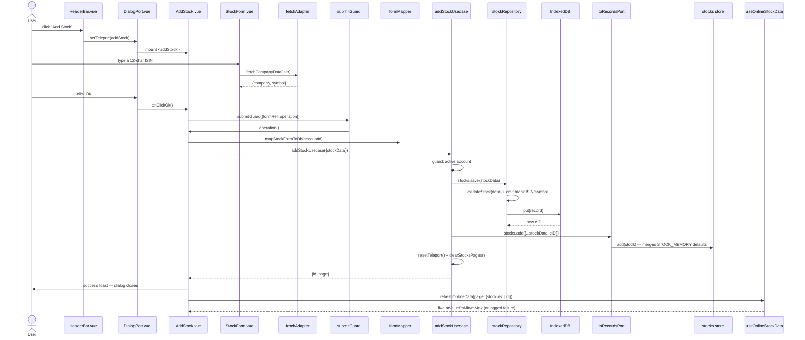

# Add Stock — File-by-File Walkthrough

This document traces what happens, file by file, when a user adds a stock to the active
account's depot. It follows the same dialog shape as [Add Booking](add-booking.md), with
one addition: an ISIN-driven auto-fetch of company/symbol data, and a post-save online
quote refresh that runs outside the save's own error handling.

See also: [Edit Stock](edit-stock.md) · [Delete Stock](delete-stock.md)

## Quick file map

| Layer                  | File                                                                                                                                           | Role                                                                                         |
|------------------------|------------------------------------------------------------------------------------------------------------------------------------------------|----------------------------------------------------------------------------------------------|
| Entry point            | `/src/adapters/ui/views/HeaderBar.vue` (Company view)                                                                                          | Renders the **Add Stock** toolbar button                                                     |
| Action wiring          | `/src/adapters/ui/composables/useHeaderBarActions.ts`                                                                                          | Opens the dialog — no `hasActiveAccount` guard here (see step 1)                             |
| Dialog registration    | `/src/adapters/ui/plugins/components.ts`                                                                                                       | Maps `"addStock"` to `AddStock.vue`                                                          |
| Dialog component       | `/src/adapters/ui/components/dialogs/AddStock.vue`                                                                                             | Builds the payload, calls the usecase, then triggers a post-save quote refresh               |
| Form fields            | `/src/adapters/ui/components/dialogs/forms/StockForm.vue`                                                                                      | ISIN (with auto-fetch), company, symbol; `:isUpdate="false"` hides the update-only fields    |
| Form state             | `/src/adapters/ui/composables/useForms.ts` (`createStockFormManager`)                                                                          | Reactive `stockFormData`                                                                     |
| Field-level validation | `/src/adapters/ui/validationAdapter.ts` (`isinRules`, `symbolRules`)                                                                           | Checksum/format checks plus a per-account duplicate check                                    |
| Duplicate check        | `/src/domain/validation/duplicates.ts` (`isDuplicateStockIsin`/`isDuplicateStockSymbol`), via `records.stocks.isDuplicate`/`isDuplicateSymbol` | Backed by the account-scoped unique indexes `stocks_uk3`/`uk4`                               |
| Live data fetch        | `/src/adapters/driven/fetch/...` (`fetchAdapter.fetchCompanyData`)                                                                             | Resolves company name + symbol from a typed ISIN                                             |
| Form → DB mapping      | `/src/domain/mapping/formMapper.ts` (`mapStockFormToDb`)                                                                                       | Uppercases/trims ISIN and symbol, attaches the account id                                    |
| Usecase                | `/src/app/usecases/stocks.ts` (`addStockUsecase`)                                                                                              | Active-account guard, persist, update the store, invalidate stock paging                     |
| Repository             | `/src/adapters/driven/database/repositories/stockRepository.ts`                                                                                | Persists to IndexedDB; omits blank ISIN/symbol rather than storing `""`                      |
| Record validation      | `/src/domain/validation/validators.ts` (`validateStock`)                                                                                       | Normalizes/whitelists the record, dropping RAM-only `m*` fields                              |
| Pinia store            | `/src/adapters/ui/stores/stocks.ts` (`useStocksStore`)                                                                                         | In-memory reactive stock list; `add()` merges `INDEXED_DB.STORE.STOCK_MEMORY` defaults       |
| Post-save refresh      | `/src/adapters/ui/composables/useOnlineStockData.ts` (`refreshOnlineData`)                                                                     | Fetches live price/min/max for the just-added stock, isolated from the save's own error path |

## Step by step

### 1. Opening the dialog

`HeaderBar.vue`'s **Add Stock** dispatches to `useHeaderBarActions.ts`'s `addStock`:

```ts
addStock: () => {
    openDialog("addStock");
},
```

Unlike `addBooking`/`addBookingType`, there is **no `hasActiveAccount` guard** at this
call site. The invariant is still enforced — just one layer down, inside
`addStockUsecase` itself (step 4) — so an attempt to add a stock with no active account
fails with a clear error from the usecase rather than being intercepted earlier by the
header bar.

### 2. The form — `StockForm.vue`, ISIN-driven auto-fetch

Rendered with `:isUpdate="false"`, so only three fields show: ISIN, company, symbol (the
meeting/quarter dates, fade-out/first-page checkboxes, and URL are update-only — see
[Edit Stock](edit-stock.md)).

Typing a 12-character ISIN triggers `onUpdateIsin`, which — unless the market-data
service is disabled (`settings.service === "none"`, the offline/e2e path) — calls
`fetchAdapter.fetchCompanyData(isin)` to auto-fill `company` and `symbol`. A
monotonically increasing `isinUpdateSeq` guards against out-of-order resolution: every
keystroke that leaves the ISIN at exactly 12 characters re-triggers a fetch, and without
the sequence check an older, slower request could resolve after a newer one and overwrite
the form with data for an ISIN the user has since corrected. A fetch failure clears
`company`/`symbol` and reports the error rather than leaving stale data from a previous
ISIN in place.

Both ISIN and symbol carry a **duplicate check** as part of their Vuetify rules —
`records.stocks.isDuplicate`/`isDuplicateSymbol`, backed by the same per-account unique
composite indexes (`stocks_uk3` on `[cAccountNumberID, cISIN]`, `uk4` on
`[cAccountNumberID, cSymbol]`) that the repository itself relies on as the last-resort
backstop (step 5). Unlike account IBANs, these indexes are account-scoped, not global, so
the same ISIN can exist once per account without colliding.

### 3. Clicking OK

Same `submitGuard` shape as every other dialog (`errorContext: "ADD_STOCK"`). Inside
`operation`:

```ts
const stockData = mapStockFormToDb(activeAccountId.value);
const res = await addStockUsecase(
    {repositories, records: toRecordsPort(records), runtime, stocksPage: runtime.stocksPage},
    {stockData}
);
await alertAdapter.feedbackInfo(t(...), t("components.dialogs.addStock.messages.success"));
reset();
```

`mapStockFormToDb` (`formMapper.ts`) strips whitespace and uppercases `cISIN`/`cSymbol`,
trims `cCompany`/`cURL`, converts the two checkboxes to `0`/`1`, and attaches the account
id.

### 4. The usecase — `addStockUsecase`

`/src/app/usecases/stocks.ts`'s `addStockUsecase`:

1. **Guard: active account.** Rejects (`xx_no_active_account`) unless
   `cAccountNumberID` is a positive integer — the same guard, same
   orphan-blocks-every-export reasoning, as `addBookingUsecase`/`addBookingTypeUsecase`
   (see [Add Booking](add-booking.md) §6). This is the guard that substitutes for the
   header-bar check step 1 doesn't have.
2. **Persist**: `repositories.stocks.save(stockData)`.
3. **Update the store**: `records.stocks.add({...stockData, cID: id})` — via
   `toRecordsPort`, which validates a second time (see
   [Add Booking](add-booking.md) §8). `useStocksStore.add` then merges in
   `INDEXED_DB.STORE.STOCK_MEMORY`'s RAM-only defaults (`mValue`, `mMin`, `mMax` at `0`,
   etc.) — placeholders until the post-save refresh (step 6) or the next visit to the
   Company view fills them in.
4. `runtime.resetTeleport()` closes the dialog.
5. `runtime.clearStocksPages()` — a brand-new stock has no holdings yet, so it sorts to
   the end of its `cFirstPage` group and may land on a different page than the one being
   viewed.
6. Returns `{id, page: deps.stocksPage}` — the page the caller was on when the dialog was
   opened, handed back so the post-save refresh (step 6 below) knows which page to
   re-fetch.

### 5. Persisting — `stockRepository.ts` and `validateStock`

`stockRepository.ts`'s `save` runs `validateStock` (whitelists the record, dropping the
RAM-only `m*` fields entirely — `validateStock` rebuilds from an explicit `cXxx` list),
then mirrors `accountRepository.ts`'s blank-IBAN handling for **two** fields:

```ts
const toPersist: StockDb = {...validated};
if (toPersist.cISIN?.trim() === "") delete toPersist.cISIN;
if (toPersist.cSymbol?.trim() === "") delete toPersist.cSymbol;
```

Both `cISIN` and `cSymbol` are optional in `StockDb` specifically so this can be
expressed in the type system. Without this, a blank ISIN or symbol would persist as
`""`, and IndexedDB indexes an explicit empty string as a real, colliding value under the
per-account unique composite indexes — so a *second* stock with a blank identifier for
the same account would fail with a raw `ConstraintError` instead of the friendly
duplicate message `StockForm`'s own rules are meant to catch first.

### 6. Post-save online refresh — isolated from the save's own error path

Back in `AddStock.vue`, after the success toast and `reset()`:

```ts
runtime.beginDownload();
runtime.beginStockLoading();
try {
    await refreshOnlineData(res.page, {stockIds: [res.id]});
} catch (refreshErr) {
    log("COMPONENTS DIALOGS AddStock: post-save quote refresh failed", refreshErr, "warn");
} finally {
    runtime.endStockLoading();
    runtime.endDownload();
}
```

This network call runs **after** the write has committed and the success alert has
already shown, in its own `try/catch` deliberately separate from `submitGuard`'s. Without
that isolation, a provider timeout here would be reported through
`alertAdapter.feedbackError` with `errorContext: "ADD_STOCK"` — producing "stock added
successfully" immediately followed by an add-stock *error*, for a stock that had, in
fact, already been added. `importDatabaseUsecase` draws the identical line for the same
reason. Passing `stockIds: [res.id]` rather than relying on `refreshOnlineData`'s
positional page-slice fallback is what keeps this correct even if the user has sorted the
Company table between opening the dialog and the fetch resolving.

## Sequence diagram



## Related documents

- [Edit Stock](edit-stock.md) · [Delete Stock](delete-stock.md)
- [`/src/README.md`](/src/README.md) — Fetch Adapter & Online Data section (provider mechanics, caching)
- [`/src/app/usecases/README.md`](/src/app/usecases/README.md) §5.1
- `/tests/e2e/happy-path.spec.ts` — `add company by ISIN (firefox): create new company with ISIN DE000BASF111`
