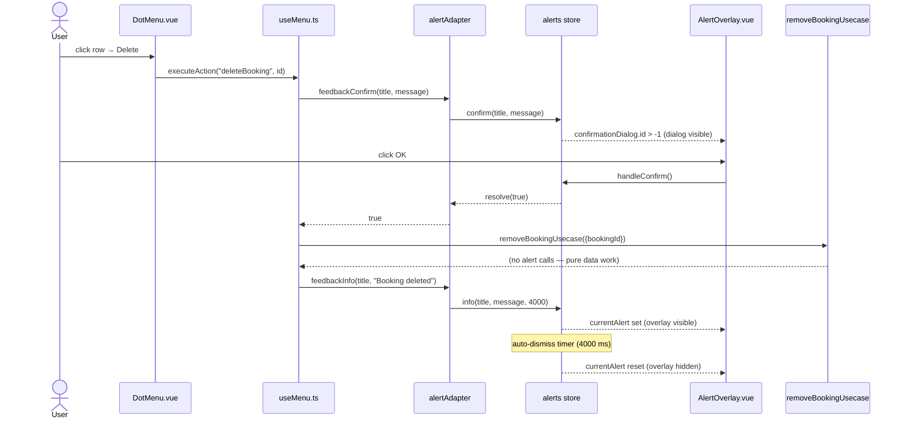

# Alerts & Popups — How App-Wide Feedback Works

This document explains the mechanism behind every toast, error message, and Yes/No
confirmation dialog the app shows a user — not one specific add/edit/delete flow, but the
cross-cutting infrastructure every one of those flows calls into. It closes with a
concrete, file-by-file trace of one real alert lifecycle.

See also: [`/src/app/usecases/README.md`](/src/app/usecases/README.md) §14 (short summary)

## Quick file map

| Layer                | File                                                                | Role                                                                                        |
|-----------------------|----------------------------------------------------------------------|----------------------------------------------------------------------------------------------|
| Types                 | `/src/domain/types/uiLayer/alerts.ts`                                | `VisibleAlertData` — the shape of one queued alert                                            |
| Types                 | `/src/domain/types/ui.ts`                                             | `HandleUserAlertOptions` — the per-call options every `feedback*` accepts                     |
| Port (usecase-facing) | `/src/app/usecases/ports.ts` (`AlertPort`)                            | Declared for usecases to depend on — see "Usecases never call alerts directly" below          |
| Driven adapter        | `/src/adapters/driven/alertAdapter.ts` (`createAlertAdapter`)         | Rate-limiting, duration defaults, error normalization, logging; sink-agnostic                 |
| Pinia store           | `/src/adapters/ui/stores/alerts.ts` (`useAlertsStore`)                | The actual alert **sink**: queue, current alert, confirmation dialog, auto-dismiss timers      |
| UI component          | `/src/adapters/ui/components/AlertOverlay.vue`                        | Renders the queue as a `v-overlay`/`v-alert` and the confirmation as a `v-dialog`              |
| DI wiring             | `/src/adapters/container.ts`                                          | Creates the adapter with no sink configured yet                                               |
| DI wiring             | `/src/adapters/ui/plugins/pinia.ts` (`createAppPinia`)                | `adapters.alertAdapter.configureAlertSink(() => useAlertsStore(pinia))` — closes the loop      |
| Call-site helper      | `/src/adapters/ui/composables/useDialogGuards.ts` (`submitGuard`)     | Turns a thrown usecase error into `feedbackError` automatically for every dialog's OK button   |

## The four kinds of feedback

Every caller reaches the adapter through `useAdapters().alertAdapter`, which exposes
exactly four methods — never the Pinia store directly (only `AlertOverlay.vue` and
`pinia.ts`'s wiring import `useAlertsStore`):

| Method             | Default auto-dismiss                          | Typical use                                                        |
|---------------------|-------------------------------------------------|----------------------------------------------------------------------|
| `feedbackSuccess`   | 4000 ms                                          | The result of a create/update completing — e.g. "Account created"    |
| `feedbackInfo`      | 4000 ms                                          | Neutral notices — e.g. the database-versionchange notice in `app.ts` |
| `feedbackWarning`   | 4000 ms                                          | Recoverable problems — e.g. form-invalid nudge in `submitGuard`      |
| `feedbackError`     | `null` (stays until dismissed)                   | Failures — always logged first, unconditionally, before rendering    |
| `feedbackConfirm`   | n/a — resolves on button click, not a timer      | Yes/No prompts — deletes, import/export overwrite warnings           |

`feedbackSuccess` is the newest of the five and is used specifically for the
create/update dialogs (`AddAccount`/`UpdateAccount`, `AddBooking`/`UpdateBooking`,
`AddBookingType`/`UpdateBookingType`, `AddStock`/`UpdateStock`); everything that isn't
"a record was just created or updated" — the delete flows, the versionchange notice,
guard messages like "no selection" — still goes through `feedbackInfo`/`feedbackWarning`.
`AlertPort`/`AlertSink`'s method names mirror the adapter: `success` / `info` / `warning`
/ `error` / `confirm`.

Each `feedback*` call takes `(title, message, options?)`. `message` accepts a plain
string, a string array, an `Error`, or an `AppError` — `normalizedError()` in
`alertAdapter.ts` collapses all four into one newline-joined string before it ever reaches
the store. `options` (`HandleUserAlertOptions`) can override the duration
(`{duration: null}` to force "stays open", used for the database-versionchange notice in
`app.ts` since the app becomes read-only from that point and the message must not
auto-hide), the rate-limit window, or a correlation id for log correlation.

## Usecases never call alerts directly

`AlertPort` is declared in `ports.ts` as the interface a usecase's dependencies *could*
carry, but no file under `src/app/usecases/` currently imports or uses it — a usecase just
does its DB/store work and **throws** on failure. Showing feedback is entirely the calling
UI code's job:

- A dialog's `onClickOk` wraps its usecase call in `submitGuard({..., errorTitle, errorContext, operation})`.
  If `operation` throws, `submitGuard`'s own `catch` calls
  `alertAdapter.feedbackError(errorTitle, err, {data: errorContext})` — every dialog gets
  consistent error reporting for free, without writing its own `try/catch`.
- A **success** message is not automatic — the calling code adds an explicit
  `await alertAdapter.feedbackInfo(title, message)` line right after the usecase call
  succeeds (see `AddAccount.vue`'s `onClickOk`, or `useMenu.ts`'s `deleteBooking` handler).
- A **confirmation** (delete, import/export overwrite) is asked *before* the usecase runs,
  via a direct `await alertAdapter.feedbackConfirm(...)` call — not through `submitGuard`
  at all, since confirmation is a gate, not error handling.

## Rate limiting, queueing, and dismissal

- **Rate limiting** (`alertAdapter.ts`): `info`/`warning`/`error` calls are keyed on
  `` `${kind}|${title}|${message}` `` and suppressed if the same key fired within the last
  1500 ms (`ALERT_INFO.RATE_LIMIT_MS`, overridable per call via `options.rateLimitMs`).
  This stops a fast failure loop (e.g. a retried network call) from flooding the user with
  identical toasts. `feedbackConfirm` is **never** rate-limited — a suppressed confirmation
  used to resolve to `undefined`, which every call site coerced to `false` via
  `!!(await feedbackConfirm(...))`, silently behaving like the user clicked Cancel on an
  import/export/delete they never even saw asked.
- **Queueing** (`alerts.ts` store): `showAlert` pushes onto `alertQueue`; if nothing is
  currently shown it becomes `currentAlert` immediately, otherwise it waits. `pendingCount`
  drives the "N more alerts pending" caption `AlertOverlay.vue` shows under the current
  one. Only one alert is ever on screen at a time; only one confirmation dialog can be open
  at a time — a second `confirm()` call while one is active **rejects** (not resolves
  `false`), which callers distinguish via `isConfirmDialogBusyError`.
- **Auto-dismiss**: a duration attached at `showAlert` time isn't started until the alert
  actually becomes `currentAlert` (`startAutoDismissTimer`), so a queued alert's timer
  can't expire before it was ever shown.

## Concrete example: deleting a booking

This traces one full alert lifecycle end to end — a confirmation dialog followed by a
success toast — for the row-level **Delete** action on a booking (see
[Delete Booking](delete-booking.md) for the full deletion flow; this section focuses only
on the alerting parts of it).

### 1. The confirmation prompt

The user opens a booking row's `DotMenu` and clicks **Delete**. `useMenu.ts`'s dispatch
table calls its own `confirmDestructive` helper before touching any data:

```ts
// src/adapters/ui/composables/useMenu.ts
const confirmDestructive = async (message: string): Promise<boolean> => {
    try {
        return !!(await alertAdapter.feedbackConfirm?.(
            resolveMessage("composables.useMenu.messages.confirmDeleteTitle"),
            message,
            {confirm: {confirmText: t("..."), cancelText: t("..."), type: "warning"}}
        ));
    } catch (err) {
        if (isConfirmDialogBusyError(err)) return false;
        throw err;
    }
};
```

`feedbackConfirm` → `alertAdapter.ts`'s `feedbackConfirm` → `getAlertSinkOrThrow()` (not
the `Safe` variant — a confirmation that *can't even be asked* must not silently read as
"the user said no") → `alerts.confirm(title, message, options)` on the Pinia store. That
sets `confirmationDialog.value` to a fresh `ConfirmationDialogData` with a new id and a
`Promise` whose `resolve`/`reject` are stashed as the dialog's button handlers.

### 2. Rendering

`showConfirmation` (`computed(() => confirmationDialog.value.id > -1)`) flips true.
`AlertOverlay.vue` — mounted once, globally, from `AppIndex.vue` — has a `v-dialog` bound
to exactly that computed, showing the warning icon, the translated message, and Cancel/OK
buttons wired to `handleCancel`/`handleConfirm`.

### 3. The user clicks OK

`handleConfirm()` calls `confirmationDialog.value.resolve()`, which the store's `confirm()`
wired to first call `resetConfirmationDialog()` (hiding the dialog) and then
`resolve(true)`. The awaited `alertAdapter.feedbackConfirm(...)` call back in `useMenu.ts`
returns `true`, `confirmDestructive` returns `true`, and the delete proceeds:

```ts
async deleteBooking(recordId: number) {
    if (!(await confirmDestructive(...))) return;

    await removeBookingUsecase(
        {repositories, records: toRecordsPort(records), runtime},
        {bookingId: recordId}
    );
    await alertAdapter.feedbackInfo(
        resolveMessage("composables.useMenu.title"),
        resolveMessage("composables.useMenu.messages.delete")
    );
}
```

Note `removeBookingUsecase` itself never touches `alertAdapter` — exactly the boundary
described above. If it throws (e.g. the DB connection drops mid-delete), `useMenu.ts`'s own
surrounding `try/catch` in `executeAction` reports it via `feedbackError` instead; there is
no `submitGuard` here since this flow has no form and no OK button routed through
`DialogPort.vue`.

### 4. The success toast

`feedbackInfo` → not rate-limited (first time this title/message pair has fired) →
`getAlertSinkSafe()` (the `Safe` variant this time — a toast that can't be shown is simply
not shown, unlike a confirmation) → `alerts.info(title, message, 4000)` → `showAlert("info", ...)`.
Since no other alert is currently displayed, it becomes `currentAlert` immediately and
`startAutoDismissTimer` schedules `dismissAlert(id)` in 4000 ms.

`AlertOverlay.vue`'s `showOverlay` computed flips true; the `v-alert` renders with the
`info` type/icon and the message; after 4 seconds `dismissAlert` fires on its own (or
earlier if the user clicks the close button), `alertQueue` empties, and `currentAlert`
resets to its `id: -1` default — `showOverlay` goes false and the overlay disappears.

### Sequence diagram



## Related documents

- [Delete Booking](delete-booking.md) — the full flow this example's data side belongs to
- [`/src/app/usecases/README.md`](/src/app/usecases/README.md) §14 — one-paragraph summary
- `/src/README.md` — architecture-level mention of the alert system
