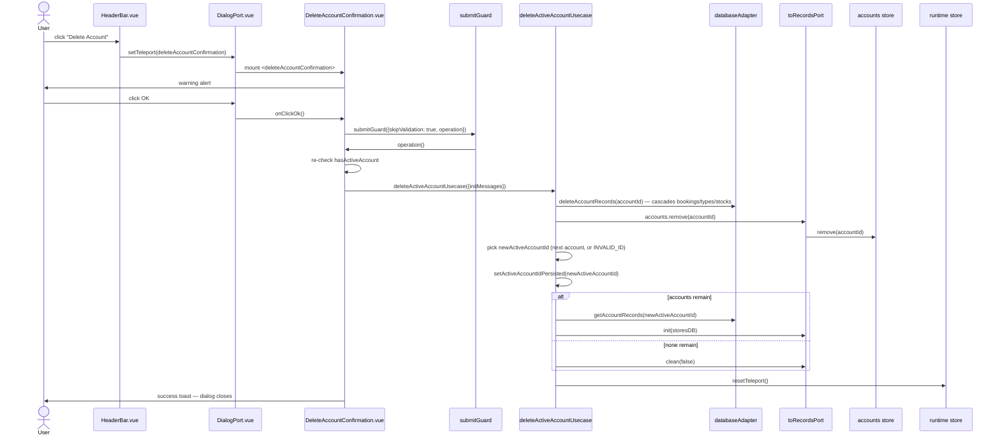

# Delete Account — File-by-File Walkthrough

This document traces what happens, file by file, when a user deletes the **active**
account. Unlike deleting a booking (a bare confirm + direct usecase call, see
[Delete Booking](delete-booking.md)), this flow *does* use a full teleport dialog — the
confirmation itself is the dialog's only content.

See also: [Add Account](add-account.md) · [Edit Account](edit-account.md)

## Quick file map

| Layer               | File                                                                         | Role                                                                             |
|---------------------|------------------------------------------------------------------------------|----------------------------------------------------------------------------------|
| Entry point         | `/src/adapters/ui/views/HeaderBar.vue`                                       | Renders the **Delete Account** toolbar button                                    |
| Action wiring       | `/src/adapters/ui/composables/useHeaderBarActions.ts`                        | Guards on `records.hasActiveAccount` before opening the dialog                   |
| Dialog registration | `/src/adapters/ui/plugins/components.ts`                                     | Maps `"deleteAccountConfirmation"` to `DeleteAccountConfirmation.vue`            |
| Dialog component    | `/src/adapters/ui/components/dialogs/DeleteAccountConfirmation.vue`          | A warning alert plus an OK button — no form fields                               |
| Usecase             | `/src/app/usecases/accounts.ts` (`deleteActiveAccountUsecase`)               | Cascading delete, active-account fallback, best-effort persistence with recovery |
| Database adapter    | `/src/adapters/driven/database/...` (`databaseAdapter.deleteAccountRecords`) | Removes the account **and** its bookings/booking types/stocks from IndexedDB     |

## Step by step

### 1. Opening the dialog

`HeaderBar.vue`'s **Delete Account** dispatches to `useHeaderBarActions.ts`'s
`deleteAccountConfirmation`:

```ts
deleteAccountConfirmation: async () => {
    if (!records.hasActiveAccount) {
        await alertAdapter.feedbackInfo(t("views.headerBar.infoTitle"), t("views.headerBar.messages.noAccount"));
    } else {
        openDialog("deleteAccountConfirmation");
    }
},
```

Worth noting for anyone reading `dialogActions`: a *separate* `deleteAccount` entry also
exists in that same table, with identical guard logic, but it is dead code — `HeaderBar`
only ever emits 16 specific action ids, and `deleteAccount` is not one of them (the bar
uses `deleteAccountConfirmation` directly). It is kept only so that wiring a future
`deleteAccount` control wouldn't silently no-op against an exhaustive `Record` type that
already has an entry for the key.

### 2. The dialog itself — a confirmation, not a form

`DeleteAccountConfirmation.vue` has no `AccountForm`, no injected form manager — its
entire template is one of two `v-alert`s:

```html
<v-alert v-if="!records.hasActiveAccount">{{ t("views.headerBar.messages.noAccount") }}</v-alert>
<v-alert v-else type="warning">{{ t("components.dialogs.deleteAccountConfirmation.messages.confirm") }}</v-alert>
```

Both branches gate on `records.hasActiveAccount` — the same predicate `onClickOk` checks
— rather than a bare `accounts.items.length === 0`. Those two predicates diverge in
exactly the state `hasActiveAccount` exists to name: "accounts exist but none is active."
Under the old length-only test, that state showed the red "are you sure?" warning, and
only after the user clicked through it did the handler discover there was nothing to
delete.

### 3. Clicking OK

```ts
await submitGuard({
    skipValidation: true,   // a confirmation has no form to validate
    isConnected: databaseAdapter.isConnected(),
    ...
    operation: async () => {
        if (!records.hasActiveAccount) {
            await alertAdapter.feedbackInfo(t(...), t("views.headerBar.messages.noAccount"));
            return;
        }
        await deleteActiveAccountUsecase({databaseAdapter, records: toRecordsPort(records), settings: toSettingsPort(settings), runtime, setStorage}, {initMessages});
        await alertAdapter.feedbackInfo(t(...), t("components.dialogs.deleteAccountConfirmation.messages.success"));
    }
});
```

`skipValidation: true` is required explicitly — `submitGuard`'s validation gate is
fail-closed, so a dialog with genuinely no form must say so, or an omitted `formRef`
would be treated as "could not validate" rather than "nothing to validate."

The `hasActiveAccount` re-check **inside** `operation` (not just in the template) is
deliberate defense in depth: this exact precondition used to be checked only once, at
click time, outside the `isLoading` reentrancy guard that protects every other dialog —
so nothing stopped the usecase from running against the "no active account" sentinel,
deleting nothing, and still reporting success. Re-checking inside `operation` re-reads
the precondition at the moment it actually matters.

### 4. The usecase — `deleteActiveAccountUsecase`

`/src/app/usecases/accounts.ts`'s `deleteActiveAccountUsecase`:

1. **Cascading delete**: `databaseAdapter.deleteAccountRecords(accountToDelete)` removes
   the account **and every booking, booking type, and stock that references it** from
   IndexedDB in one call — there is no separate cleanup step for orphaned child records.
2. `records.accounts.remove(accountToDelete)`.
3. **Picks the next active account**: the first remaining account (`records.accounts.items[0].cID`), or
   `INDEXED_DB.INVALID_ID` (the named sentinel, not
   a bare `-1`) if none remain. No account survives being the "last one" specially — the
   app is allowed to land in a genuine zero-accounts state.
4. **Persists the new active id, tolerating failure differently than every other
   usecase**: because `accountToDelete` is already gone from IndexedDB by this point,
   `setActiveAccountIdPersisted`'s normal rollback (revert to the previous id on a
   storage-write failure) would revert to an account that no longer exists. So on
   failure here, the usecase forces `settings.activeAccountId` to the new id anyway,
   captures the error, and continues — the in-memory cleanup below must happen
   regardless of whether the persist succeeded, and the captured error is re-thrown only
   at the very end.
5. **Re-initializes the record stores** for whichever account is now active: `clean(false)`
   if none remain, or a fresh `databaseAdapter.getAccountRecords(newActiveAccountId)` +
   `records.init(...)` otherwise — populating the newly active account's own bookings,
   booking types, and stocks.
6. `runtime.resetTeleport()` closes the dialog.
7. If a persistence error was captured in step 4, it is thrown here — after all cleanup
   has already run, so the user sees an accurate error without the app being left in a
   half-updated state.

## Sequence diagram



## Related documents

- [Add Account](add-account.md) · [Edit Account](edit-account.md)
- [`/src/app/usecases/README.md`](/src/app/usecases/README.md) §2.3
- `/tests/e2e/dialog-actions.spec.ts` — `deleteAccountConfirmation: removes the active account`
