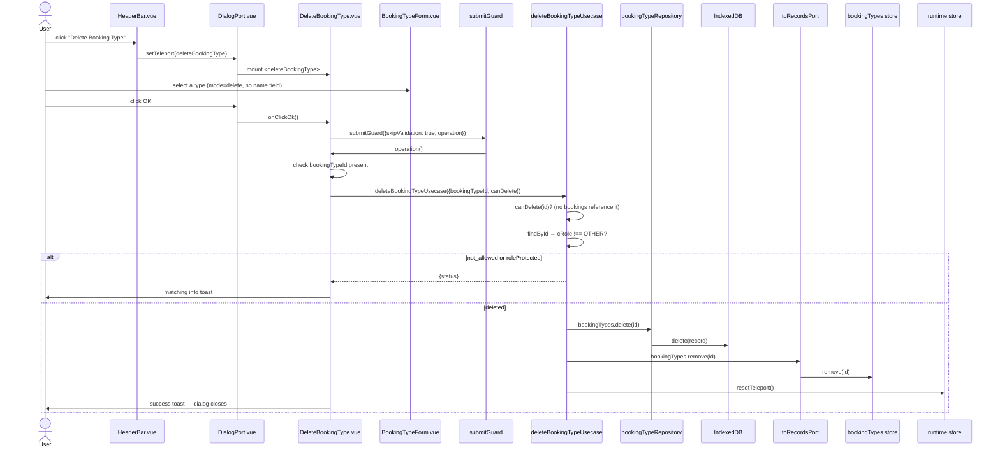

# Delete Booking Type — File-by-File Walkthrough

This document traces what happens, file by file, when a user deletes a booking type. Like
[Edit Booking Type](edit-booking-type.md), the dialog must let the user select which type
first; unlike deleting a booking or an account, deletion here can be blocked for two
independent reasons before anything is written.

See also: [Add Booking Type](add-booking-type.md) · [Edit Booking Type](edit-booking-type.md)

## Quick file map

Everything in [Add Booking Type](add-booking-type.md)'s file map applies unchanged, plus:

| Layer            | File                                                                              | Role                                                           |
|------------------|-----------------------------------------------------------------------------------|----------------------------------------------------------------|
| Entry point      | `/src/adapters/ui/views/HeaderBar.vue`                                            | Renders the **Manage Booking Types → Delete** toolbar button   |
| Dialog component | `/src/adapters/ui/components/dialogs/DeleteBookingType.vue`                       | Hosts the type-selector, checks deletability, runs the delete  |
| Form fields      | `/src/adapters/ui/components/dialogs/forms/BookingTypeForm.vue` (`mode="delete"`) | Only the `v-select` — no name field is ever shown in this mode |
| Usecase          | `/src/app/usecases/bookingTypes.ts` (`deleteBookingTypeUsecase`)                  | Two independent blocking checks, then delete, then invalidate  |

## Step by step

### 1. Opening the dialog

`HeaderBar.vue`'s **Delete** entry opens `"deleteBookingType"` the same way as the other
booking-type dialogs. `DeleteBookingType.vue`'s `onBeforeMount` calls `reset()` on the
shared `createBookingTypeFormManager()` form state.

### 2. Selecting a type — `BookingTypeForm.vue` in `mode="delete"`

```html
<v-text-field v-if="(edit && props.mode !== 'delete') || props.mode === 'add'" .../>
```

In `mode="delete"`, that condition is always false — only the `v-select` picker renders;
the name field never appears, since there is nothing to edit, only something to identify.
Selecting an item still runs the same `onSelect` as update mode, populating
`bookingTypeFormData.id`/`name`/`role`, even though `name`/`role` are never displayed
here — the usecase reads `id` off the form to know what to delete.

### 3. Clicking OK — the id check moved inside the guard

```ts
await submitGuard({
    skipValidation: true,   // a selector plus a confirmation-free delete — no form fields to validate
    ...
    operation: async () => {
        const bookingTypeId = bookingTypeFormData.id;
        if (!bookingTypeId) {
            await alertAdapter.feedbackInfo(t(...), t("components.dialogs.deleteBookingType.messages.noSelection"));
            return;
        }
        const res = await deleteBookingTypeUsecase(
            {repositories, records: toRecordsPort(records), runtime},
            {bookingTypeId, canDelete: canDeleteBookingType}
        );
        ...
    }
});
```

Note there is **no `confirmDestructive` prompt** here, unlike
[Delete Booking](delete-booking.md) or [Delete Account](delete-account.md) — selecting a
type and clicking OK deletes it immediately if the two checks below both pass. The
`bookingTypeId` read and the `!bookingTypeId` check both moved **inside** `operation` for
the same reentrancy reason as [Edit Booking Type](edit-booking-type.md) §3: as a
pre-check outside `submitGuard`'s `isLoading` guard, a double click could have fired the
delete twice.

### 4. The usecase — `deleteBookingTypeUsecase`

```ts
const canDeleteBookingType = (bookingTypeId: number): boolean =>
    !records.bookings.hasBookingType(bookingTypeId);
```

`/src/app/usecases/bookingTypes.ts`'s `deleteBookingTypeUsecase`:

1. **`canDelete` check** — the caller-supplied predicate above: a type still referenced
   by any existing booking cannot be deleted. Returns `{status: "not_allowed"}` without
   touching anything.
2. **Role-protection check** — a Buy/Sell/Dividend-role type is refused even if
   `canDelete` passed, i.e. even with zero bookings referencing it yet:
   ```ts
   const bookingType = await deps.repositories.bookingTypes.findById(input.bookingTypeId);
   if (bookingType && bookingType.cRole !== BOOKING_TYPE_ROLE.OTHER) {
       return {status: "roleProtected"};
   }
   ```
   This exists because a brand-new depot account is in *exactly* that state — its Buy
   type has no bookings yet — and deleting it there would leave the account still
   advertising itself as depot-enabled (`cWithDepot: true`) while
   `resolveTypeIdByRole` can no longer resolve a Buy type at all:
   `mapBookingFormToDb`'s `isStockRelated` check then fails for every remaining type,
   and `BookingForm.vue` hides the stock picker and count field outright — with no
   on-screen explanation of why a stock-related booking can no longer be entered.
   Recovery existed but was undiscoverable: [Add Booking Type](add-booking-type.md) has
   no role control, so a manually re-created type is always `other`; the only way back is
   toggling `withDepot` off and on again to re-run `createDefaultBookingTypes`. This
   guard closes that hole at the source instead of relying on a hidden recovery path.

   `canDelete` is checked *first*: "bookings are assigned" is the more specific,
   actionable answer when both conditions happen to apply.
3. **Delete**: `repositories.bookingTypes.delete(input.bookingTypeId)` (inherited
   unchanged from `baseRepository.ts`, same as booking deletion — no validator runs since
   nothing is being written).
4. **Update the store**: `records.bookingTypes.remove(input.bookingTypeId)`.
5. `runtime.resetTeleport()` closes the dialog.

Unlike [Edit Booking Type](edit-booking-type.md), there is no `clearStocksPages()` call
here — a *deleted* type, by construction, has no bookings referencing it (`canDelete`
guaranteed that), so removing it cannot change any stock's FIFO holdings.

### 5. Feedback per outcome

`DeleteBookingType.vue` branches on `res.status`: `not_allowed` → "cannot delete, still
in use"; `roleProtected` → a distinct message explaining the role guard; otherwise a
plain success toast.

## Sequence diagram



## Related documents

- [Add Booking Type](add-booking-type.md) · [Edit Booking Type](edit-booking-type.md)
- [`/src/app/usecases/README.md`](/src/app/usecases/README.md) §4.2
- `/tests/e2e/dialog-actions.spec.ts` — `deleteBookingType: creates then deletes a fresh, unreferenced booking type`
