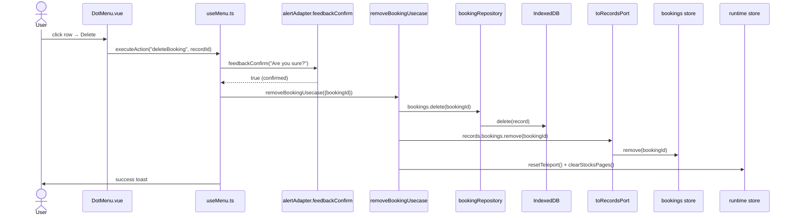

# Delete Booking — File-by-File Walkthrough

This document traces what happens, file by file, when a user deletes a booking. Unlike
Add/Edit Booking, there is **no dialog component** for this flow at all — no
`DeleteBooking.vue`, and nothing registered under a `"deleteBooking"` name in
`/src/adapters/ui/plugins/components.ts`. The whole flow lives in one composable.

## Quick file map

| Layer                 | File                                                                                                             | Role                                                                   |
|-----------------------|------------------------------------------------------------------------------------------------------------------|------------------------------------------------------------------------|
| Entry point           | `/src/adapters/ui/components/DotMenu.vue` (row action menu)                                                      | Renders the **Delete** row action on the HomeContent booking table     |
| Action + confirmation | `/src/adapters/ui/composables/useMenu.ts` (`useMenuAction`)                                                      | Confirms, then calls the usecase directly — no dialog, no form         |
| Confirmation prompt   | `/src/adapters/ui/stores/alerts.ts` (via `alertAdapter.feedbackConfirm`)                                         | A `v-dialog`-based Yes/No prompt, not a `DialogPort` teleport dialog   |
| Usecase               | `/src/app/usecases/bookings.ts` (`removeBookingUsecase`)                                                         | Deletes from IndexedDB, updates the store, invalidates dependent state |
| Repository            | `/src/adapters/driven/database/repositories/bookingRepository.ts` (`delete`, inherited from `baseRepository.ts`) | Removes the row from IndexedDB                                         |
| Pinia store           | `/src/adapters/ui/stores/bookings.ts` (`useBookingsStore.remove`)                                                | Removes the item from the reactive `items` array                       |

## Step by step

### 1. Clicking Delete on a row

The user opens a booking row's `DotMenu` and clicks **Delete**. This reaches
`useMenu.ts`'s `executeAction`, which — same as every row action — first records which
row is being acted on:

```ts
runtime.activeId = recordId;
```

(unused for delete, since the id is passed straight to the handler as `recordId`, but set
uniformly for every row action).

The dispatch table's `deleteBooking` handler is where all the actual logic lives:

```ts
async deleteBooking(recordId: number) {
    if (!(await confirmDestructive(
        resolveMessage("composables.useMenu.messages.confirmDeleteBooking")
    ))) {
        return;
    }

    await removeBookingUsecase(
        {repositories, records: toRecordsPort(records), runtime},
        {bookingId: recordId}
    );
    await alertAdapter.feedbackInfo(resolveMessage("composables.useMenu.title"), resolveMessage("composables.useMenu.messages.delete"));
},
```

### 2. Confirmation — `confirmDestructive`, not a teleport dialog

Deleting a booking is irreversible with no undo, so `useMenu.ts` asks for confirmation
first via its own `confirmDestructive` helper:

```ts
const confirmDestructive = async (message: string): Promise<boolean> => {
    try {
        return !!(await alertAdapter.feedbackConfirm?.(
            resolveMessage("composables.useMenu.messages.confirmDeleteTitle"),
            message,
            {confirm: {confirmText: ..., cancelText: ..., type: "warning"}}
        ));
    } catch (err) {
        if (isConfirmDialogBusyError(err)) return false;
        throw err;
    }
};
```

This is a materially different mechanism from `DeleteAccountConfirmation.vue` or
`DeleteBookingType.vue`: those are full dialog *components* rendered through
`DialogPort.vue`'s teleport (`runtime.dialogName`/`dialogVisibility`), each with its own
`onClickOk` routed through `submitGuard`. A booking delete instead calls
`alertAdapter.feedbackConfirm` directly — a self-contained Yes/No prompt owned by the
alert/notification sink, not the dialog hub. `feedbackConfirm` **rejects** (rather than
resolving `false`) if a confirmation is already open; the `catch` here treats that
specific rejection as "not confirmed" (a second delete click while one prompt is already
up should quietly do nothing) while re-throwing anything else, such as the alert sink
being unavailable at all.

### 3. The usecase — `removeBookingUsecase`

If the user confirms, `/src/app/usecases/bookings.ts`'s `removeBookingUsecase` runs:

```ts
export async function removeBookingUsecase(deps, input: {bookingId: number}): Promise<void> {
    await deps.repositories.bookings.delete(input.bookingId);
    deps.records.bookings.remove(input.bookingId);
    deps.runtime.resetTeleport();
    deps.runtime.clearStocksPages();
}
```

This is the simplest of the three booking usecases: no guards (there is nothing to
validate about *removing* a record — the id either exists or the delete is a no-op), no
form mapping, no `validateBooking` pass (nothing is being written).

1. **Delete from IndexedDB** — `bookings.delete` is inherited unchanged from
   `baseRepository.ts`; `bookingRepository.ts` adds no override for it (unlike `save`,
   which wraps `validateBooking`).
2. **Remove from the store** — `records.bookings.remove(id)`, wrapped by `toRecordsPort`
   only as a plain `.bind()` passthrough (removal needs no validation, so `toRecordsPort`
   does not intercept it the way it does `add`/`update`). `useBookingsStore.remove`
   filters the deleted id out of `items`.
3. **`runtime.resetTeleport()`** — present even though this flow never opened a teleport
   dialog in the first place; harmless (resets already-default state) and kept for
   consistency with the other write usecases.
4. **`runtime.clearStocksPages()`** — removing a booking changes a stock's FIFO holdings,
   same invalidation as add/edit.

### 4. Feedback

Back in `useMenu.ts`, a single success toast follows (`composables.useMenu.messages.delete`). There is no per-outcome
branching the way
`deleteStock`'s sibling handler has (which distinguishes "has bookings, can't delete"
from success) — a booking can always be deleted, nothing else references it.

Any error thrown by the usecase (e.g. a database-connection failure) is caught by
`executeAction`'s own `try/catch`, which reports it via `alertAdapter.feedbackError`
rather than `submitGuard`'s — there is no `submitGuard` anywhere in this flow, since
there is no form and no OK button routed through `DialogPort.vue`.

## Sequence diagram



## Related documents

- [Add Booking](add-booking.md) · [Edit Booking](edit-booking.md)
- [`/src/app/usecases/README.md`](/src/app/usecases/README.md) §3.3
- `/tests/e2e/dialog-actions.spec.ts` — `deleteBooking: removes the booking via the row menu (no confirmation step)`
