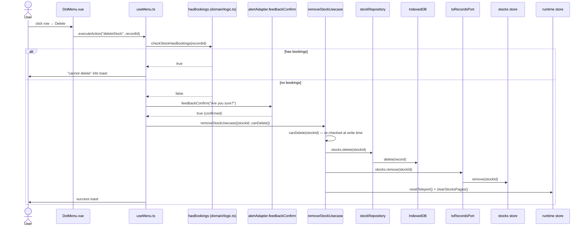

# Delete Stock — File-by-File Walkthrough

This document traces what happens, file by file, when a user deletes a stock. Like
[Delete Booking](delete-booking.md), there is no dedicated dialog component — the whole
flow lives in `useMenu.ts` — but deletion here is guarded by the same referential
invariant in **three** independent places, which is worth understanding together.

See also: [Add Stock](add-stock.md) · [Edit Stock](edit-stock.md)

## Quick file map

| Layer                              | File                                                                                                           | Role                                                                      |
|------------------------------------|----------------------------------------------------------------------------------------------------------------|---------------------------------------------------------------------------|
| Entry point                        | `/src/adapters/ui/components/DotMenu.vue` (row action menu)                                                    | Renders the **Delete** row action on the CompanyContent stock table       |
| Action + confirmation              | `/src/adapters/ui/composables/useMenu.ts` (`useMenuAction`)                                                    | Pre-checks, confirms, calls the usecase — no dialog, no form              |
| Referential check (UI pre-check)   | `/src/domain/logic.ts` (`hasBookings`), via `useMenu.ts`'s `checkStockHasBookings`                             | Whether any booking still references the stock                            |
| Referential check (row affordance) | `/src/adapters/ui/stores/portfolio.ts` (`mDeleteable`)                                                         | Drives whether the row's delete control is enabled at all                 |
| Referential check (usecase guard)  | `/src/app/usecases/stocks.ts` (`removeStockUsecase`'s `canDelete` parameter)                                   | The actual gate the write is behind                                       |
| Confirmation prompt                | `/src/adapters/ui/stores/alerts.ts` (via `alertAdapter.feedbackConfirm`)                                       | A Yes/No prompt, same mechanism as [Delete Booking](delete-booking.md) §2 |
| Repository                         | `/src/adapters/driven/database/repositories/stockRepository.ts` (`delete`, inherited from `baseRepository.ts`) | Removes the row from IndexedDB                                            |
| Pinia store                        | `/src/adapters/ui/stores/stocks.ts` (`useStocksStore.remove`)                                                  | Removes the item from the reactive `items` array                          |

## Step by step

### 1. Clicking Delete on a row

`useMenu.ts`'s `deleteStock` handler:

```ts
async deleteStock(recordId: number) {
    if (checkStockHasBookings(recordId)) {
        await alertAdapter.feedbackInfo(resolveMessage("composables.useMenu.title"), resolveMessage("composables.useMenu.messages.noDelete"));
        return;
    }

    if (!(await confirmDestructive(resolveMessage("composables.useMenu.messages.confirmDeleteStock")))) {
        return;
    }

    const result = await removeStockUsecase(
        {repositories, records: toRecordsPort(records), runtime},
        {stockId: recordId, canDelete: (id) => !checkStockHasBookings(id)}
    );

    if (result.status === "not_allowed") {
        await alertAdapter.feedbackInfo(resolveMessage("composables.useMenu.title"), resolveMessage("composables.useMenu.messages.noDelete"));
        return;
    }

    await alertAdapter.feedbackInfo(resolveMessage("composables.useMenu.title"), resolveMessage("composables.useMenu.messages.delete"));
},
```

Unlike `deleteBooking`, this handler has **three** distinct steps before anything is
written: a pre-check, a confirmation, and the usecase's own guard — repeating the same
question (`checkStockHasBookings`) at both ends deliberately.

### 2. The referential invariant, checked in three places

A stock still referenced by a booking must not be deletable — every one of the three
integrity checks in the app (`healthChecker.performHealthCheck`,
`findExportConsistencyIssues`, and backup-import's `validateForeignKeys`, all sharing one
implementation) would flag or reject a database containing a booking that points at a
deleted stock. `removeStockUsecase`'s own doc comment spells out what makes this
particular invariant worth stating three times rather than once:

1. **Row affordance** — `/src/adapters/ui/stores/portfolio.ts` computes `mDeleteable =
   !bookings.hasStockID(stockId)` for every row, which the CompanyContent table uses to
   enable/disable the row's delete control in the first place.
2. **UI pre-check** — `checkStockHasBookings` (wrapping `domain/logic.ts`'s `hasBookings`)
   runs again at click time, before the confirmation prompt even appears, so the user
   sees "cannot delete" immediately rather than after confirming.
3. **Usecase guard** — `canDelete` is injected into `removeStockUsecase` and checked a *third* time, at the moment of
   the actual write.

Before this third check existed, `removeStockUsecase` was the **only** deletion usecase
in the layer that trusted its callers to have already enforced the invariant —
`deleteActiveAccountUsecase` cascades unconditionally and `deleteBookingTypeUsecase`
takes the identical `canDelete`-predicate shape this file now uses, but stock deletion
had no defense at this layer at all. That mattered because a booking left pointing at a
deleted stock still passes `healthChecker.performHealthCheck` and
`findExportConsistencyIssues` — so the backup file writes successfully — and is then **rejected on import** by
`validateForeignKeys`. Without the usecase-level guard, any
second call site reaching `removeStockUsecase` directly (a keyboard shortcut, a bulk
action, a test harness) could produce a database the app could export but not restore
from its own backup, discovered only when the user actually needed the backup.

### 3. Confirmation — same mechanism as Delete Booking

`confirmDestructive` here is the identical helper documented in
[Delete Booking](delete-booking.md) §2 — a direct `alertAdapter.feedbackConfirm` call,
not a `DialogPort` teleport dialog, with the same "a rejection means a confirmation is
already open, not a decline" handling.

### 4. The usecase — `removeStockUsecase`

```ts
export async function removeStockUsecase(deps, input: {stockId: number; canDelete: (id: number) => boolean}) {
    if (!input.canDelete(input.stockId)) {
        return {status: "not_allowed"};
    }
    await deps.repositories.stocks.delete(input.stockId);
    deps.records.stocks.remove(input.stockId);
    deps.runtime.resetTeleport();
    deps.runtime.clearStocksPages();
    return {status: "deleted"};
}
```

The `canDelete` closure passed from `useMenu.ts` — `(id) => !checkStockHasBookings(id)` — **re-reads the store at
operation time**, not at the moment the row's menu was clicked,
closing the window between the two pre-checks (steps 1–2) and the actual write. On a
refusal, the usecase leaves IndexedDB and the store completely untouched and returns
`{status: "not_allowed"}` instead of throwing — an ordinary, expected outcome rather than
an error condition, the same shape `deleteBookingTypeUsecase` uses.

`clearStocksPages()` runs on the success path because removing a stock shifts every
later stock one position forward in its page.

## Sequence diagram



## Related documents

- [Add Stock](add-stock.md) · [Edit Stock](edit-stock.md)
- [Delete Booking](delete-booking.md) — the same no-dialog, `confirmDestructive` pattern
- [Delete Booking Type](delete-booking-type.md) — the same injected `canDelete` shape
- [`/src/app/usecases/README.md`](/src/app/usecases/README.md) §5.3
- `/tests/e2e/dialog-actions.spec.ts` — `deleteStock: adds a disposable stock then deletes it via the row menu`
