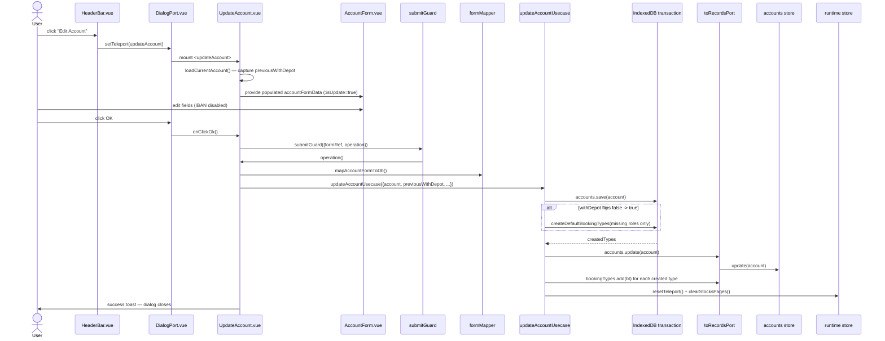

# Edit Account — File-by-File Walkthrough

This document traces what happens, file by file, when a user edits the **active**
account. It is the companion to [Add Account](add-account.md); the form, mapping, and
repository are shared, but pre-fill, validation, and the usecase's write path all differ.

See also: [Add Account](add-account.md) · [Delete Account](delete-account.md)

## Quick file map

Everything in [Add Account](add-account.md)'s file map applies unchanged, plus:

| Layer            | File                                                     | Role                                                                            |
|------------------|----------------------------------------------------------|---------------------------------------------------------------------------------|
| Entry point      | `/src/adapters/ui/views/HeaderBar.vue`                   | Renders the **Edit Account** toolbar button                                     |
| Action wiring    | `/src/adapters/ui/composables/useHeaderBarActions.ts`    | Guards on `records.hasActiveAccount` before opening the dialog                  |
| Dialog component | `/src/adapters/ui/components/dialogs/UpdateAccount.vue`  | Loads the active account, saves changes back                                    |
| Usecase          | `/src/app/usecases/accounts.ts` (`updateAccountUsecase`) | Persists, conditionally seeds default booking types, invalidates FX/quote state |

## Step by step

### 1. Opening the dialog

`HeaderBar.vue`'s **Edit Account** dispatches to `useHeaderBarActions.ts`'s
`updateAccount`:

```ts
updateAccount: async () => {
    if (!records.hasActiveAccount) {
        await alertAdapter.feedbackInfo(t("views.headerBar.infoTitle"), t("views.headerBar.messages.noAccount"));
    } else {
        openDialog("updateAccount");
    }
},
```

Unlike Add Account, this dialog always edits the *currently active* account — there is
no account picker in the form, and `records.hasActiveAccount` (not a bare
`accounts.items.length` check) is what gates the button, so "accounts exist but none is
active" reports the correct message instead of opening a dialog with nothing to load.

### 2. Mounting `UpdateAccount.vue` — loading the record

`onBeforeMount` calls `loadCurrentAccount()`:

1. Looks up `records.accounts.getById(activeAccountId.value)`.
2. **Bails out on a failed lookup** — same defense-in-depth pattern as
   [Edit Booking](edit-booking.md) §2: shows `xx_missing_record` and
   `runtime.resetTeleport()`. The header bar's guard performs the same lookup already, so
   this closes the window between that check and this one (and any future call site that
   opens the dialog without the guard — `useMenu.ts` declares an `updateAccount` handler
   with no wiring to any menu, precisely so a later menu addition doesn't bypass this).
   Without the guard, a failed lookup would leave the form's `id` at its default `-1`,
   `mapAccountFormToDb`'s `data.id > 0` check would omit `cID`, `baseRepository.save()`
   would read that as an insert, and a second account would be silently created while
   `records.accounts.update()` no-ops on the missing id.
3. Captures `previousWithDepot.value = currentAccount.cWithDepot` **before** the user can
   touch the depot switch — needed so `onClickOk` can later detect a false→true
   transition even after `accountFormData.withDepot` has already been changed by the
   user.
4. Copies every field into `accountFormData`, falling back `cCurrency ?? CURRENCIES.EUR`
   for a record that predates schema migration 29 (which is what normally stamps
   `cCurrency` onto every row).

### 3. Editing — `AccountForm.vue` with `:isUpdate="true"`

The **IBAN field is disabled** on this path (`:disabled="props.isUpdate"`), because an
IBAN is the account's identity (`accounts_uk1`) and is deliberately immutable once
created. Critically, `ibanRules` is an **empty array** on update, not merely "the add
rules with this account excluded from the duplicate check":

```ts
const ibanRules = computed(() =>
    props.isUpdate ? [] : validationAdapter.ibanRules(IBAN_RULES, (iban) => records.accounts.isDuplicate(iban))
);
```

This isn't cosmetic. Vuetify runs a **disabled** input's validation rules anyway —
`useValidation` registers with the form unconditionally and its `validate()` has no
disabled short-circuit — so a rules array on this field would still be evaluated and
still fail the form for any account whose *stored* IBAN happens to be blank or
checksum-invalid. Both states are ordinary, not corrupt: `AccountDb.cIban` is optional by
design (a blank one is omitted rather than stored, see [Add Account](add-account.md) §5),
and `validateAccount` only logs a warning on a bad checksum rather than rejecting it, so
an imported invalid IBAN persists. Before this was fixed, `submitGuard`'s fail-closed
form check meant such an account could **never** be saved again through this dialog —
currency, SWIFT, the depot flag, and the logo were all permanently uneditable, with
nothing on screen explaining why a greyed-out field was blocking the form.

Every other field (SWIFT, currency, depot switch, logo URL) behaves exactly as on add.

### 4. Clicking OK

Same `submitGuard` shape, `errorContext` differs only by name. Inside `operation`:

```ts
const account = mapAccountFormToDb() as AccountDb;
await updateAccountUsecase(
    {databaseAdapter, repositories, records: toRecordsPort(records), runtime},
    {account, previousWithDepot: previousWithDepot.value, bookingTypeLabels: {...}}
);
```

The `as AccountDb` cast reflects that `accountFormData.id` was populated with the real
`cID` in step 2, so `mapAccountFormToDb`'s `data.id > 0` branch returns a full record.

### 5. The usecase — `updateAccountUsecase`

`/src/app/usecases/accounts.ts`'s `updateAccountUsecase`, inside one transaction spanning
`accounts` and `bookingTypes`:

1. `repositories.accounts.save(input.account, {tx})`.
2. **Conditionally seeds default booking types** — only when `cWithDepot` is now `true`
   **and** `previousWithDepot` was `false` (a genuine off→on transition). This mirrors
   [Add Account](add-account.md)'s seeding exactly, including reading existing roles from
   the *repository* (`findByAccount`, scoped to this account) rather than
   `records.bookingTypes.items` — the store holds only the active account's types, so
   filtering it by account id would look account-scoped while being correct only because
   this dialog can edit nothing but the active account; a future caller without that
   constraint would silently create a duplicate Buy/Sell/Dividend set.
   `existingRoles` makes the whole thing idempotent: toggling the switch off and back on
   repeatedly fills in only whatever roles are still missing, never creating a same-role
   duplicate (which `resolveTypeIdByRole` would then resolve inconsistently).
3. Turning `withDepot` **off** deletes nothing — no booking types, no bookings. The
   account simply stops advertising itself as depot-enabled; existing Buy/Sell/Dividend
   types and any fee/tax-bearing bookings recorded under them remain exactly as they
   were.
4. `records.accounts.update(input.account)`, then `records.bookingTypes.add(bt)` for each
   newly created type.
5. `runtime.resetTeleport()` closes the dialog.
6. `runtime.clearStocksPages()` — unconditionally, not gated on whether `cCurrency`
   actually changed. Editing the account can change the currency quotes are converted
   into; invalidating the freshness markers forces the next render to re-fetch. This
   invalidation is **not** the complete fix for a currency change on its own — the actual
   re-conversion divisors (`runtime.curUsd`/`curEur`) are written elsewhere (`AppIndex.vue`'s `displayCurrency` watcher,
   which re-fetches FX rates and only then
   clears the pages again); this call stays because currency is not the only reason to
   invalidate here, and this usecase's own concern must not depend on a UI-layer watcher
   for correctness.

## Sequence diagram



## Related documents

- [Add Account](add-account.md) · [Delete Account](delete-account.md)
- [`/src/app/usecases/README.md`](/src/app/usecases/README.md) §2.2
- `/tests/e2e/dialog-actions.spec.ts` — `updateAccount: edits the active account's SWIFT code`
