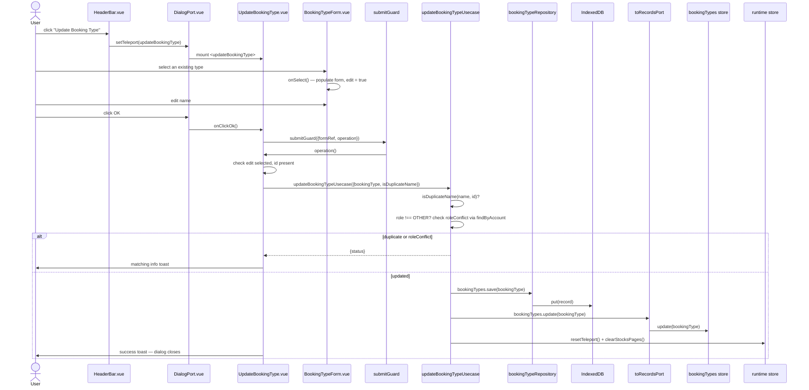

# Edit Booking Type — File-by-File Walkthrough

This document traces what happens, file by file, when a user renames or re-roles a
booking type. It is the companion to [Add Booking Type](add-booking-type.md); the
notable difference is that this dialog must let the user first **select** which type to
edit, since — unlike Edit Booking/Edit Account — there is no single "active" booking type
and no row-menu entry point either.

See also: [Add Booking Type](add-booking-type.md) · [Delete Booking Type](delete-booking-type.md)

## Quick file map

Everything in [Add Booking Type](add-booking-type.md)'s file map applies unchanged, plus:

| Layer            | File                                                                              | Role                                                                     |
|------------------|-----------------------------------------------------------------------------------|--------------------------------------------------------------------------|
| Entry point      | `/src/adapters/ui/views/HeaderBar.vue`                                            | Renders the **Manage Booking Types → Update** toolbar button             |
| Dialog component | `/src/adapters/ui/components/dialogs/UpdateBookingType.vue`                       | Hosts the type-selector + name form, runs the update                     |
| Form fields      | `/src/adapters/ui/components/dialogs/forms/BookingTypeForm.vue` (`mode="update"`) | A `v-select` of existing types, plus the name field once one is selected |
| Usecase          | `/src/app/usecases/bookingTypes.ts` (`updateBookingTypeUsecase`)                  | Duplicate check, role-conflict check, persist, invalidate stock paging   |

## Step by step

### 1. Opening the dialog — deliberately not pre-populated from `runtime.activeId`

`HeaderBar.vue`'s **Update** entry opens `"updateBookingType"` the same way as
[Add Booking Type](add-booking-type.md). `UpdateBookingType.vue`'s `onBeforeMount` calls
`loadCurrentBookingType()`, which does nothing but `resetForm()` — no attempt is made to
guess which type the user wants to edit from `runtime.activeId`. A comment in the file
explains why that matters:

> `runtime.activeId` is a generic "last booking/stock row acted on" id, written
> unconditionally by `useMenu.ts`'s `executeAction()` for row actions. This dialog is
> only ever reachable via `HeaderBar.vue`'s icon, which never sets `activeId` — so it
> could hold a stale booking/stock id from a completely different IndexedDB store, which
> happens to collide with a real (but unrelated) booking type's own auto-increment id.
> Pre-selecting from it would silently let a user rename/re-role the wrong booking type
> with no visible sign anything was wrong.

The dropdown always requires an explicit user selection instead.

### 2. Selecting a type — `BookingTypeForm.vue` in `mode="update"`

With `mode="update"`, the form renders a `v-select` of the account's own booking types (alphabetical, same convention as
`BookingForm`'s stock/type pickers), plus the name
field once a selection is made:

```ts
const onSelect = (id: number | null) => {
    if (!id) return;
    const item = records.bookingTypes.getById(id);
    if (item) {
        edit.value = true;
        bookingTypeFormData.id = item.cID;
        bookingTypeFormData.name = item.cName;
        bookingTypeFormData.role = item.cRole;
        nextTick(() => nameInput.value?.focus());
    }
};
```

`edit` is exposed via `defineExpose({edit})` specifically so `UpdateBookingType.vue` can
check it at submit time (step 3) — clearing the selector (`@click:clear="onClear"`) resets
`edit` to `false` without touching `bookingTypeFormData` itself.

### 3. Clicking OK — two pre-checks before the usecase

```ts
if (!bookingTypeRef.value?.edit) {
    await alertAdapter.feedbackInfo(t(...), t("components.dialogs.updateBookingType.messages.noSelection"));
    return;
}
if (!bookingTypeFormData.id) {
    await alertAdapter.feedbackInfo(t(...), t("components.dialogs.updateBookingType.messages.noId"));
    return;
}
```

Both checks run **inside** `operation` (i.e. inside `submitGuard`'s `isLoading`
reentrancy guard and after `formRef.validate()`), not as a pre-check ahead of
`submitGuard` — a comment on this dialog notes it was moved there specifically so a
selection made between the click and the operation actually running is picked up, and so
a double-click can't slip past a reentrancy window that a pre-check outside the guard
wouldn't close.

### 4. The usecase — `updateBookingTypeUsecase`

```ts
const res = await updateBookingTypeUsecase(
    {repositories, records: toRecordsPort(records), runtime},
    {bookingType, isDuplicateName: (name, id) => records.bookingTypes.isDuplicate(name, id)}
);
```

`/src/app/usecases/bookingTypes.ts`'s `updateBookingTypeUsecase`:

1. **Duplicate check** — `isDuplicateName(cName, cID)`, excluding the type's own id so
   renaming a type to its own unchanged name doesn't flag itself. Returns
   `{status: "duplicate"}` without writing.
2. **Role-conflict check** — only when the new `cRole` is **not** `OTHER`. Reads
   `repositories.bookingTypes.findByAccount(cAccountNumberID)` (the repository, not
   `records.bookingTypes.items` — for the identical account-scoping reason documented in
   [Edit Account](edit-account.md) §5) and checks whether any *other* type in the account
   already holds that role. If so, returns `{status: "roleConflict"}` without writing. A
   `buy`/`sell`/`dividend` role must stay unique per account because
   `resolveTypeIdByRole` (`domain/logic.ts`) only ever resolves the *first* match — a
   second same-role type would silently drop every booking recorded under it from
   portfolio, invest, and dividend totals. `other` is exempt: arbitrarily many custom
   types are fine.
3. **Persist**: `repositories.bookingTypes.save(input.bookingType)`.
4. **Update the store**: `records.bookingTypes.update(input.bookingType)`.
5. `runtime.resetTeleport()` closes the dialog.
6. `runtime.clearStocksPages()` — **only reached on the success path**, since the
   duplicate/roleConflict returns above write nothing and so have nothing to invalidate.
   Changing a type's role changes which bookings count toward a stock's holdings (calculations resolve Buy/Sell/Dividend
   by the type's *current* `cRole`, not a fixed
   id), which can move a stock across pages.

### 5. Feedback per outcome

`UpdateBookingType.vue` branches on `res.status` to show the matching message (`duplicate`, `roleConflict`, or
`success`) — unlike
[Add Booking Type](add-booking-type.md), none of these use `rateLimitMs: 0`, since this
dialog closes on success (`runtime.resetTeleport()` inside the usecase) rather than
staying open for repeated entry.

## Sequence diagram



## Related documents

- [Add Booking Type](add-booking-type.md) · [Delete Booking Type](delete-booking-type.md)
- [`/src/app/usecases/README.md`](/src/app/usecases/README.md) §4.2
- `/tests/e2e/dialog-actions.spec.ts` — `updateBookingType: renames the existing booking type`
