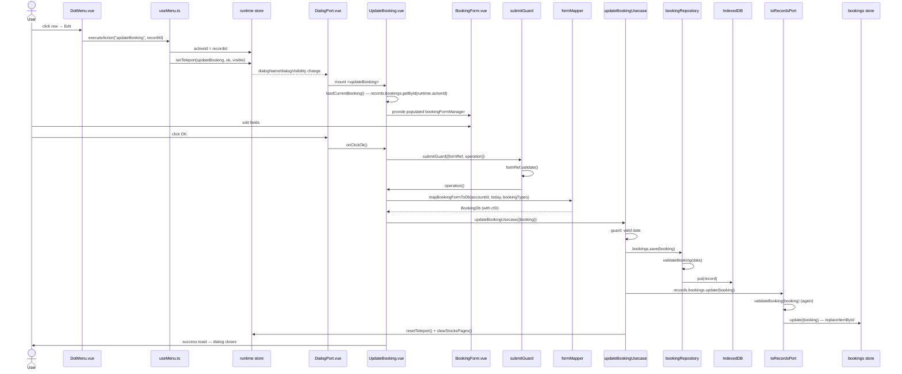

# Edit Booking — File-by-File Walkthrough

This document traces what happens, file by file, when a user edits an existing booking.
It is the companion to [Add Booking](add-booking.md) — most of the plumbing (form shell,
field visibility, validation rules, `formMapper`) is identical; this document only spells
out what differs: how the dialog is reached, how it pre-fills, and what the usecase does
differently on write.

## Quick file map

Everything in [Add Booking](add-booking.md)'s file map applies unchanged, plus:

| Layer            | File                                                        | Role                                                                                        |
|------------------|-------------------------------------------------------------|---------------------------------------------------------------------------------------------|
| Entry point      | `/src/adapters/ui/components/DotMenu.vue` (row action menu) | Renders the **Edit** row action on the HomeContent booking table                            |
| Action wiring    | `/src/adapters/ui/composables/useMenu.ts` (`useMenuAction`) | Dispatches `updateBooking`, opens the dialog with `runtime.activeId` set to the clicked row |
| Dialog component | `/src/adapters/ui/components/dialogs/UpdateBooking.vue`     | Loads the existing record into the form, then saves it back                                 |
| Usecase          | `/src/app/usecases/bookings.ts` (`updateBookingUsecase`)    | Domain guard, persists, updates the store, invalidates dependent state                      |

## Step by step

### 1. Opening the dialog — from a row, not the header bar

Unlike Add Booking (opened from `HeaderBar.vue` via `useHeaderBarActions.ts`), Edit
Booking is opened from a specific row's `DotMenu` on the HomeContent booking table. The
click reaches `useMenu.ts`'s `executeAction`, which does two things before dispatching:

```ts
const executeAction = async (actionType: MenuActionType, recordId: number): Promise<void> => {
    runtime.activeId = recordId;   // <-- which booking this dialog will load
    ...
    await handler(recordId);
};
```

`runtime.activeId` is the mechanism `UpdateBooking.vue` uses to know *which* booking to
load — there is no prop or route param carrying the id, since `DialogPort.vue` renders
the dialog component with no arguments (`<component :is="runtime.dialogName"/>`). The
matching handler in `useMenuAction`'s `actionHandlers` table is:

```ts
async updateBooking() {
    openDialog("updateBooking", true);
},
```

This `openDialog` is `useMenu.ts`'s own local copy of the same
`runtime.setTeleport({dialogName, dialogOk, dialogVisibility: true})` call
`useHeaderBarActions.ts` uses for header-bar actions — two call sites, same runtime
store, same mechanism.

### 2. Mounting `UpdateBooking.vue` — loading the record

`UpdateBooking.vue`'s `onBeforeMount` calls `loadCurrentBooking()`, which:

1. Calls `resetForm()` first, to blank out anything left over from a previous open of
   this dialog.
2. Looks up `records.bookings.getById(runtime.activeId)`.
3. **Bails out if the lookup fails** — shows `xx_missing_record` and calls
   `runtime.resetTeleport()` (closing the dialog) instead of continuing with a blank
   form. This guard exists because a blank form's `id` stays `-1`, and
   `mapBookingFormToDb`'s `data.id > 0` gate would then omit `cID` from the mapped
   record entirely — turning what should be an *update* into an *insert*
   (`baseRepository.save()` reads a missing `cID` as "create"), producing a duplicate
   booking while `records.bookings.update()` silently no-ops because no item in the
   store has the (nonexistent) id it was given.
4. Reconstructs the form's Credit/Debit field pairs from each DB record's single signed
   value — the exact inverse of `formMapper.ts`'s `debit - credit` collapse:
   ```ts
   const asPair = (v: number) => ({credit: v < 0 ? -v : 0, debit: v > 0 ? v : 0});
   ```
5. Restores `cExDate` **only if it isn't the sentinel** `DATE.ISO` ("1970-01-01") that
   `formMapper.ts` writes into every non-dividend booking's ex-date column. Copying that
   sentinel back verbatim would pre-fill the Ex-date field the instant a booking is
   retyped to Dividend — since the field is `v-if="isDividendType"`, `isoDateRules`'
   required check never gets a blank value to reject, and the booking could be saved
   with an ex-date of 1 Jan 1970 nobody actually entered.

The rest of `bookingFormData` is copied straight across (`bookDate`, `description`,
`count`, `stockId`, `marketPlace`, `selected` from `cBookingTypeID`).

### 3. Editing — same `BookingForm.vue`, same role-conditional fields

`UpdateBooking.vue` mounts the identical `BookingForm.vue` used by Add Booking, so field
visibility (Buy/Sell/Dividend/Other) and every Vuetify rule in `validationAdapter.ts`
behave exactly as documented in [Add Booking](add-booking.md) §3. One template
difference: `UpdateBooking.vue` renders `<BookingForm/>` with no `isUpdate` prop, because
— unlike `AccountForm`/`StockForm` — bookings have no uniqueness constraint and no
update-mode behavior for the form to branch on.

### 4. Clicking OK — same `submitGuard`, `errorContext: "UPDATE_BOOKING"`

Identical shape to Add Booking's `onClickOk`: `submitGuard` validates the form, checks
the DB connection, then runs `operation`. The only functional difference in `operation`
is which mapper output and usecase are called:

```ts
const booking = mapBookingFormToDb(activeAccountId.value, DATE.ISO, records.bookingTypes.items) as BookingDb;
await updateBookingUsecase({repositories, records: toRecordsPort(records), runtime}, {booking});
await alertAdapter.feedbackInfo(t("components.dialogs.updateBooking.title"), t("components.dialogs.updateBooking.messages.success"));
```

Because `bookingFormData.id` was populated in step 2 with the real `cID`,
`mapBookingFormToDb`'s `data.id > 0` branch returns a full `BookingDb` (with `cID`) this
time, not an `Omit<BookingDb, "cID">` — the cast `as BookingDb` reflects that.

### 5. The usecase — `updateBookingUsecase`

`/src/app/usecases/bookings.ts`'s `updateBookingUsecase`:

1. **Guard: valid book date.** The same `isValidISODate` guard as `addBookingUsecase`,
   for the same reason stated there — and it matters *specifically* on this path too: an
   imported, undated booking opened in this dialog and saved would otherwise keep its
   blank date, and a previously-dated booking could be edited into an undated one. Either
   way a blank date could re-enter the store through a form, not just through import.
2. **Persist**: `repositories.bookings.save(input.booking)` — same repository, same
   `validateBooking` pass as the add path (see [Add Booking](add-booking.md) §7).
3. **Update the store**: `records.bookings.update(input.booking)` — via `toRecordsPort`,
   which runs `validateBooking` a second time before calling `useBookingsStore.update`,
   for the same DB/store-consistency reason documented in
   [Add Booking](add-booking.md) §8. `useBookingsStore.update` replaces the item at its
   existing index (`replaceItemById`) rather than appending.
4. **`runtime.resetTeleport()`** — unlike `addBookingUsecase`, this closes the dialog on
   success. There is no "edit several bookings in a row" use case the way there is for
   adding, so this path follows the same pattern as every other update usecase in the
   app.
5. **`runtime.clearStocksPages()`** — a changed amount, count, or booking type can change
   a stock's FIFO holdings, same as on add.

Note there is no "guard: active account" check here, unlike `addBookingUsecase`. An
existing booking's `cAccountNumberID` was already validated when it was first created (or
imported); editing it does not change which account it belongs to, since `AccountForm`'s
counterpart field isn't exposed on `BookingForm` at all.

## Sequence diagram



## Related documents

- [Add Booking](add-booking.md) · [Delete Booking](delete-booking.md)
- [`/src/app/usecases/README.md`](/src/app/usecases/README.md) §3.2
- `/tests/e2e/dialog-actions.spec.ts` — `updateBooking: edits the existing booking's remark via the row menu`
