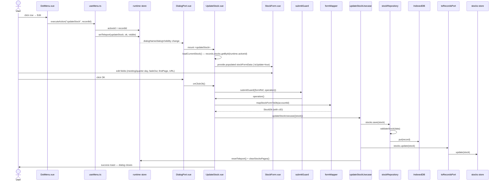

# Edit Stock — File-by-File Walkthrough

This document traces what happens, file by file, when a user edits an existing stock. It
is the companion to [Add Stock](add-stock.md) — the entry point and pre-fill follow the
same row-menu pattern as [Edit Booking](edit-booking.md), and several update-only fields
appear that the add form never shows.

See also: [Add Stock](add-stock.md) · [Delete Stock](delete-stock.md)

## Quick file map

Everything in [Add Stock](add-stock.md)'s file map applies unchanged, plus:

| Layer            | File                                                        | Role                                                                                      |
|------------------|-------------------------------------------------------------|-------------------------------------------------------------------------------------------|
| Entry point      | `/src/adapters/ui/components/DotMenu.vue` (row action menu) | Renders the **Edit** row action on the CompanyContent stock table                         |
| Action wiring    | `/src/adapters/ui/composables/useMenu.ts` (`useMenuAction`) | Dispatches `updateStock`, opens the dialog with `runtime.activeId` set to the clicked row |
| Dialog component | `/src/adapters/ui/components/dialogs/UpdateStock.vue`       | Loads the existing record into the form, then saves it back                               |
| Usecase          | `/src/app/usecases/stocks.ts` (`updateStockUsecase`)        | Persists, updates the store, invalidates stock paging                                     |

## Step by step

### 1. Opening the dialog — from a row, not the header bar

Exactly the [Edit Booking](edit-booking.md) §1 pattern: the user opens a stock row's
`DotMenu` and clicks **Edit**, reaching `useMenu.ts`'s `executeAction`, which sets
`runtime.activeId = recordId` before dispatching to:

```ts
async updateStock() {
    openDialog("updateStock", true);
},
```

`UpdateStock.vue` has no prop or route param carrying the stock id — `runtime.activeId`
is the only channel, same as `UpdateBooking.vue`.

### 2. Mounting `UpdateStock.vue` — loading the record

`onBeforeMount` calls `loadCurrentStock()`:

1. `resetForm()` first.
2. Looks up `records.stocks.getById(runtime.activeId)`.
3. **Bails out on a failed lookup** — same defense-in-depth shape as
   [Edit Booking](edit-booking.md) §2, but with a more specific consequence than usual: a
   blank form's `id` stays `-1`, so `mapStockFormToDb`'s `data.id > 0` gate omits `cID`,
   `validateStock` rebuilds that as `cID: 0`, and `baseRepository.save()` reads `0` as
   "not an update" and inserts a duplicate stock. Meanwhile `records.stocks.update()`
   resolves that *same* `cID: 0` to the placeholder "no stock" sentinel (`createPlaceholderStock`, the blank option
   `BookingForm.vue`'s stock picker relies
   on) and **overwrites it** — destroying that blank picker option for the rest of the
   session, not merely no-op'ing the way a missing booking id would.
4. Copies every field into `stockFormData`, converting the two DB integer flags back to
   booleans explicitly:
   ```ts
   fadeOut: currentStock.cFadeOut === 1,
   firstPage: currentStock.cFirstPage === 1,
   ```
   This conversion matters because `Object.assign<T, U>` returns `T & U` without checking
   assignability *into* `T` — copying the raw `0`/`1` number straight across would have
   been silently accepted by TypeScript and left the checkbox bound to a number until the
   user's first click on it replaced it with a real boolean.

### 3. Editing — update-only fields appear

`UpdateStock.vue` mounts `StockForm.vue` with `:isUpdate="true"`, which reveals four
fields the add form never shows: meeting day, quarterly-report day, the fade-out
checkbox, and the first-page checkbox, plus the URL field. ISIN and symbol remain
editable, and their duplicate rules exclude the record's own id (`props.isUpdate ? stockFormData.id : undefined`) so
saving a stock with its own
unchanged ISIN doesn't flag itself as a duplicate of itself.

### 4. Clicking OK — same `submitGuard`, `errorContext: "UPDATE_STOCK"`

```ts
const stock = mapStockFormToDb(activeAccountId.value) as StockDb;
await updateStockUsecase({repositories, records: toRecordsPort(records), runtime}, {stock});
await alertAdapter.feedbackInfo(t(...), t("components.dialogs.updateStock.messages.success"));
```

No post-save online refresh here, unlike [Add Stock](add-stock.md) — editing meeting/
quarter dates or the URL doesn't change the live quote, and the price fields themselves
aren't editable through this form at all.

### 5. The usecase — `updateStockUsecase`

`/src/app/usecases/stocks.ts`'s `updateStockUsecase` is the simplest of the three stock
usecases:

```ts
export async function updateStockUsecase(deps, input: {stock: StockDb}): Promise<void> {
    await deps.repositories.stocks.save(input.stock);
    deps.records.stocks.update(input.stock);
    deps.runtime.resetTeleport();
    deps.runtime.clearStocksPages();
}
```

No guards — an existing stock's `cAccountNumberID` was already validated when the stock
was created, and this form has no way to reassign it to a different account. The one
noteworthy invalidation is `clearStocksPages()`: editing `cFirstPage` or `cFadeOut` can
move this stock to a different page (the "first page" pinning and the passive/fade-out
partition are both paging inputs), so the freshness cache is cleared unconditionally on
every save, the same "cheap marker, invalidate regardless" reasoning documented for
[Edit Account](edit-account.md) §5.

## Sequence diagram



## Related documents

- [Add Stock](add-stock.md) · [Delete Stock](delete-stock.md)
- [`/src/app/usecases/README.md`](/src/app/usecases/README.md) §5.2
- `/tests/e2e/dialog-actions.spec.ts` — `updateStock: edits the stock's URL via the row menu`
