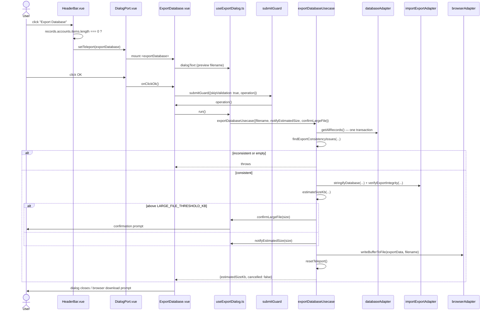

# Export Database — File-by-File Walkthrough

This document traces what happens, file by file, when a user exports the database to a
JSON backup. Unlike every CRUD flow documented so far, there is no form and no id to
guard — the dialog's entire job is to read the whole database consistently, check it for
problems the *import* side would reject, and hand the result to the browser's download
mechanism.

## Quick file map

| Layer               | File                                                                                                           | Role                                                                                                     |
|---------------------|----------------------------------------------------------------------------------------------------------------|----------------------------------------------------------------------------------------------------------|
| Entry point         | `/src/adapters/ui/views/HeaderBar.vue` (Home view)                                                             | Renders the **Export Database** toolbar button                                                           |
| Action wiring       | `/src/adapters/ui/composables/useHeaderBarActions.ts`                                                          | Guards on `records.accounts.items.length` — deliberately the length, not `hasActiveAccount` (see step 1) |
| Dialog registration | `/src/adapters/ui/plugins/components.ts`                                                                       | Maps `"exportDatabase"` to `ExportDatabase.vue`                                                          |
| Dialog component    | `/src/adapters/ui/components/dialogs/ExportDatabase.vue`                                                       | A read-only text preview plus an OK button; all logic lives in the controller                            |
| Dialog controller   | `/src/adapters/ui/composables/useExportDialog.ts` (`useExportDatabaseDialogController`)                        | Builds the filename, wires the usecase's confirmation callbacks to `alertAdapter`                        |
| Usecase             | `/src/app/usecases/backup/export.ts` (`exportDatabaseUsecase`)                                                 | Reads the whole DB in one transaction, checks consistency, serializes, verifies, writes                  |
| Consistency checks  | `/src/app/usecases/backup/exportHelpers.ts` (`findExportConsistencyIssues`, `hasExportConsistencyIssues`)      | Wraps the shared `findReferentialIssues` — the same check the *import* side runs                         |
| Filename/metadata   | `/src/app/usecases/backup/exportHelpers.ts` (`createExportFilename`, `createExportMetadata`, `estimateSizeKb`) | `{isoDate}_{dbVersion}_{dbName}.json`, the `sm` metadata block, UTF-8 byte-length estimation             |
| Database snapshot   | `/src/adapters/driven/database/...` (`databaseAdapter.getAllRecords`)                                          | One transaction reading all four stores at a single point in time                                        |
| Serialization       | `/src/adapters/driven/...` (`importExportAdapter.stringifyDatabase`, `verifyExportIntegrity`)                  | Builds the JSON string and re-parses it as a sanity check before writing                                 |
| File write          | `/src/adapters/driven/...` (`browserAdapter.writeBufferToFile`)                                                | Triggers the actual `browser.downloads.download`                                                         |

## Step by step

### 1. Opening the dialog — a length check, deliberately not `hasActiveAccount`

`HeaderBar.vue`'s **Export Database** dispatches to `useHeaderBarActions.ts`'s
`exportDatabase`:

```ts
exportDatabase: async () => {
    if (records.accounts.items.length === 0) {
        await alertAdapter.feedbackInfo(t("views.headerBar.infoTitle"), t("views.headerBar.messages.noAccount"));
    } else {
        openDialog("exportDatabase");
    }
},
```

This is the one header-bar action that keeps the plain length test rather than adopting
`hasActiveAccount` the way `updateAccount`/`deleteAccountConfirmation`/`addBookingType`
did. The comment in the file is explicit about why: export writes the **whole**
database, every account, not the active one — so "does any account exist" really is its
precondition, unlike an action that operates *on* the currently active account.

### 2. The dialog — a read-only preview, no fillable form

`ExportDatabase.vue` has no injected form manager. Its only content is a disabled
`v-textarea` showing `dialogText` — a preview string built once by the controller (`t("...text", {filename})`) using a
filename resolved from today's date. `onClickOk`
passes `skipValidation: true` to `submitGuard` for the same reason every other
no-form dialog does (see [Delete Account](delete-account.md) §3): the validation gate is
fail-closed, so a dialog with genuinely nothing to validate must say so explicitly.

### 3. Clicking OK — the controller re-derives the filename

```ts
async function run(): Promise<void> {
    const exportFilename = buildFilename();   // re-derived HERE, not reused from dialogText
    await exportDatabaseUsecase({...}, {filename: exportFilename, notifyEstimatedSize, confirmLargeFile});
}
```

The filename shown in the dialog's preview text and the filename actually written are
resolved from `new Date()` at two different moments on purpose. The preview is captured
once when the dialog opens; if the dialog is left open across midnight and `run()` reused
that same captured value, the exported file would carry the previous day's date in its
name despite writing today's data.

### 4. The usecase — `exportDatabaseUsecase`

`/src/app/usecases/backup/export.ts`'s `exportDatabaseUsecase`, in order:

1. **One transactional read**: `databaseAdapter.getAllRecords()` — not four independent
   `repository.findAll()` calls. Each of those would open its **own** transaction, so the
   four stores would be read at four different points in time, immediately before
   checking referential integrity *across* them. A write landing between two of the reads
   would produce a consistency survey of a state the database was never actually in — on
   the one path whose entire output must later be re-importable.
2. **Consistency check**: `findExportConsistencyIssues` runs the same
   `findReferentialIssues` the import path's `validateForeignKeys` runs — so export now
   blocks on exactly what import would reject. This used to check only
   `cAccountNumberID` on the three child collections; a stock deleted while bookings
   still referenced it (a state `removeStockUsecase`'s `canDelete` guard normally
   prevents — see [Delete Stock](delete-stock.md) — but which pre-existing data could
   still carry) left a dangling `cStockID` that this check now also catches.
3. **Two distinct refusals, not one**: an empty database (`issues.noAccounts`) throws
   `EXPORT_DATABASE.EMPTY` under `ERROR_CATEGORY.VALIDATION`; an *inconsistent* one
   throws `EXPORT_DATABASE.A` under `ERROR_CATEGORY.DATABASE`. These used to share one
   error code, which told a user exporting immediately after a fresh install that their (nonexistent) data had "failed
   validation" — the refusal was right, the diagnosis
   was not.
4. **Serialize and self-verify**: `importExportAdapter.stringifyDatabase(...)` builds the
   JSON string, then `verifyExportIntegrity(dataString)` re-parses that *exact* string as
   a sanity check before anything is written — not a parse of some other representation
   of the same data.
5. **Size gate, in two tiers**:
    - Above `MAX_EXPORT_SIZE_KB` (`INDEXED_DB.MAX_FILE_SIZE / 1024`, i.e. 64 MB) the export
      is refused outright (`EXPORT_DATABASE.TOO_LARGE`). This cap is deliberately the **same** number the import side
      enforces (`useImportDialog.validateFile` and
      `IMPORT_EXPORT_SERVICE.F`) — the two ends of the backup round trip used to check
      different sizes, so a database whose serialized form exceeded 64 MB could still be
      exported (it only warned around 10 MB) and then could never be restored from that
      exact backup.
    - Above `LARGE_FILE_THRESHOLD_KB` (10 MB) but under the hard cap,
      `input.confirmLargeFile(estimatedSize)` asks the user to proceed; below it,
      `input.notifyEstimatedSize` just informs them of the size. Declining the large-file
      confirmation returns `{cancelled: true}` without writing anything.
6. **Write**: `browserAdapter.writeBufferToFile(exportData, filename)` triggers the
   browser's download mechanism, then `runtime.resetTeleport()` closes the dialog.

### 5. Confirmation callbacks — the same busy-dialog handling as everywhere else

Both `notifyEstimatedSize` and `confirmLargeFile` are supplied by
`useExportDialog.ts`, wired to `alertAdapter.feedbackInfo`/`feedbackConfirm`.
`confirmLargeFile` absorbs the same specific rejection documented in
[Delete Booking](delete-booking.md) §2 and [Delete Stock](delete-stock.md) §3 — a
`feedbackConfirm` call rejecting because another confirmation is already open is read as
"not confirmed" rather than propagated as an export failure; any other rejection (the
alert sink being unavailable at all) still propagates.

## Sequence diagram



## Related documents

- [Import Database](import-database.md) — the round trip this flow's own consistency
  check and size cap are calibrated against
- [`/src/app/usecases/README.md`](/src/app/usecases/README.md) §8
- `/tests/e2e/dialog-actions.spec.ts` — `exportDatabase: triggers a download with the current data`
