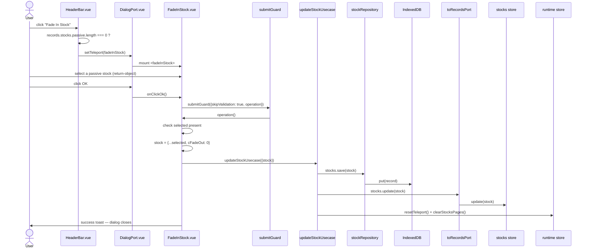

# Fade In Stock — File-by-File Walkthrough

This document traces what happens, file by file, when a user brings a previously
"faded-out" (passive) stock back into the active portfolio. It is the smallest usecase-
backed dialog in the app — no new usecase of its own, just a targeted call into the same
`updateStockUsecase` that powers [Edit Stock](edit-stock.md), flipping exactly one field.

See also: [Edit Stock](edit-stock.md) — the general-purpose stock update this dialog is a
narrow, single-field specialization of.

## Quick file map

| Layer               | File                                                  | Role                                                                                     |
|---------------------|-------------------------------------------------------|------------------------------------------------------------------------------------------|
| Entry point         | `/src/adapters/ui/views/HeaderBar.vue` (Company view) | Renders the **Fade In Stock** toolbar button                                             |
| Action wiring       | `/src/adapters/ui/composables/useHeaderBarActions.ts` | Guards on `records.stocks.passive.length`, then opens the dialog                         |
| Dialog registration | `/src/adapters/ui/plugins/components.ts`              | Maps `"fadeInStock"` to `FadeInStock.vue`                                                |
| Dialog component    | `/src/adapters/ui/components/dialogs/FadeInStock.vue` | A single stock-picker over the passive list; no form manager                             |
| Passive-stock list  | `/src/adapters/ui/stores/stocks.ts` (`passive`)       | `items.filter(cFadeOut === 1 && cID > 0)` — excludes the placeholder "no stock" sentinel |
| Usecase             | `/src/app/usecases/stocks.ts` (`updateStockUsecase`)  | The same usecase [Edit Stock](edit-stock.md) uses, called here with `cFadeOut: 0`        |

## Step by step

### 1. Opening the dialog

`HeaderBar.vue`'s **Fade In Stock** dispatches to `useHeaderBarActions.ts`'s
`fadeInStock`:

```ts
fadeInStock: async () => {
    if (records.stocks.passive.length === 0) {
        await alertAdapter.feedbackInfo(t("views.headerBar.infoTitle"), t("views.headerBar.messages.noCompany"));
    } else {
        openDialog("fadeInStock");
    }
},
```

`records.stocks.passive` is the leaf store's own filter — `cFadeOut === 1 && cID > 0`,
the `cID > 0` clause excluding the placeholder "no stock" sentinel every account's stocks
store carries (`createPlaceholderStock`) so it never appears as a selectable option here
regardless of its own `cFadeOut` value.

### 2. The dialog — a `v-select` with `return-object`, no form manager

`FadeInStock.vue` has no `createStockFormManager`/`provide` pair unlike every other stock
dialog — the entire form is one local `ref<StockItem | null>(null)`, bound with
`return-object` so `selected.value` is the live store record itself, not just its id:

```html
<v-select v-model="selected" :items="records.stocks.passive" item-title="cCompany" item-value="cID" return-object .../>
```

`return-object` matters for what happens next: `selected.value` is a **reference into
the reactive store's own array**, not a detached copy.

### 3. Clicking OK — building a fresh object rather than mutating the selection in place

```ts
if (!selected.value) {
    await alertAdapter.feedbackInfo("FadeInStock", browserAdapter.getMessage("xx_db_no_selected"));
    return;
}

// Build a fresh object instead of mutating `selected.value` in place:
const stock = {...selected.value!, cFadeOut: 0};

await updateStockUsecase({repositories, records: toRecordsPort(records), runtime}, {stock});
await alertAdapter.feedbackInfo("FadeInStock", browserAdapter.getMessage("xx_db_fade_in"));
```

The selection check moved inside `submitGuard`'s `operation` for the same reentrancy
reason documented throughout this series (e.g. [Edit Booking Type](edit-booking-type.md)
§3) — but here it does double duty: reading `selected.value` at operation time rather
than at click time is also what makes the `!` non-null assertion on the next line *sound* rather than merely true in
practice.

The spread-and-override (`{...selected.value!, cFadeOut: 0}`) is deliberate, not
stylistic. Because `return-object` binds `v-model` directly to the live store record,
mutating `selected.value.cFadeOut` in place would flip the stock to "active" in the UI **immediately** — before the
database write below has even started. If
`repositories.stocks.save` then threw, the store would show the stock as active while
IndexedDB still had it marked passive, out of sync until the next full reload. Building a
new object and only calling `updateStockUsecase` (which updates the store *after* the
write succeeds) matches [Edit Stock](edit-stock.md)'s own pattern of never touching the
store ahead of a confirmed write.

### 4. The usecase — the same `updateStockUsecase`, one field

This dialog introduces no new usecase. It calls the identical
`/src/app/usecases/stocks.ts` `updateStockUsecase` documented in
[Edit Stock](edit-stock.md) §5 — persist, update the store, `resetTeleport()`,
`clearStocksPages()` — with every field carried over unchanged from the selected record
except `cFadeOut`, now `0`. `clearStocksPages()` matters here for the same reason it
matters on a manual `cFadeOut` edit through `UpdateStock.vue`: the fade-out flag is a
paging input, so un-fading a stock can move it (and every other stock) to a different
page.

## Sequence diagram



## Related documents

- [Edit Stock](edit-stock.md) — the general-purpose update this dialog specializes
- [`/src/app/usecases/README.md`](/src/app/usecases/README.md) — listed under §13 (E2E Test Coverage) as a guard-clause
  branch, not previously given its own numbered workflow subsection
- `/tests/e2e/dialog-actions.spec.ts` — `fadeInStock` (guard-clause branch: info alert when no passive stocks exist)
