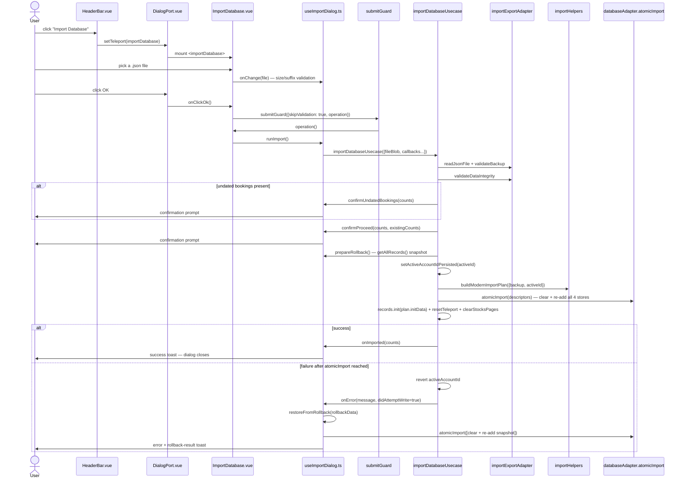

# Import Database — File-by-File Walkthrough

This document traces what happens, file by file, when a user restores a JSON backup. It
is the most involved flow in the app: two confirmations, a pre-write validation pass, a
rollback snapshot taken *after* both confirmations, an atomic multi-store write, and a
failure path that has to distinguish "nothing was written yet" from "the write may have
partially landed."

See also: [Export Database](export-database.md) — the round trip this flow's size and
consistency checks are calibrated against.

## Quick file map

| Layer                     | File                                                                                                              | Role                                                                                                                                   |
|---------------------------|-------------------------------------------------------------------------------------------------------------------|----------------------------------------------------------------------------------------------------------------------------------------|
| Entry point               | `/src/adapters/ui/views/HeaderBar.vue` (Home view)                                                                | Renders the **Import Database** toolbar button                                                                                         |
| Action wiring             | `/src/adapters/ui/composables/useHeaderBarActions.ts`                                                             | Opens the dialog unconditionally — no account precondition; a database with zero accounts is exactly what a first import restores into |
| Dialog registration       | `/src/adapters/ui/plugins/components.ts`                                                                          | Maps `"importDatabase"` to `ImportDatabase.vue`                                                                                        |
| Dialog component          | `/src/adapters/ui/components/dialogs/ImportDatabase.vue`                                                          | A single `v-file-input`; all orchestration lives in the controller                                                                     |
| Dialog controller         | `/src/adapters/ui/composables/useImportDialog.ts` (`useImportDatabaseDialogController`)                           | File validation, rollback snapshot/restore, confirmation prompts, wires everything into the usecase                                    |
| Usecase                   | `/src/app/usecases/backup/import.ts` (`importDatabaseUsecase`)                                                    | Orchestrates parse → validate → confirm → snapshot → write → re-init, all via caller-supplied callbacks                                |
| Backup parsing/validation | `/src/adapters/driven/...` (`importExportAdapter.readJsonFile`, `.validateBackup`, `.validateDataIntegrity`)      | JSON parsing, structural checks, cross-referential integrity (shared with export's own check)                                          |
| Import plan               | `/src/app/usecases/backup/importHelpers.ts` (`buildModernImportPlan`, `getImportCounts`, `normalizeModernBackup`) | Normalizes every record through the same domain validators as the live paths, builds the clear+re-add descriptors                      |
| Atomic write              | `/src/adapters/driven/database/...` (`databaseAdapter.atomicImport`)                                              | One IndexedDB transaction: clear + re-add all four stores                                                                              |
| Rollback                  | `/src/adapters/ui/composables/useImportDialog.ts` (`createRollbackPoint`, `restoreFromRollback`)                  | Whole-database snapshot before the write; clear + re-add from that snapshot on failure                                                 |

## Step by step

### 1. Opening the dialog

`HeaderBar.vue`'s **Import Database** dispatches unconditionally:

```ts
importDatabase: () => {
    openDialog("importDatabase");
},
```

No `hasActiveAccount`/length guard, unlike every other database-mutating action — a
first-ever import into a database with zero accounts is exactly the scenario this dialog
exists for.

### 2. The dialog — a file picker, with file-level validation before anything is read

`ImportDatabase.vue` has no form manager; its only control is a `v-file-input` bound to
`onChange`, which runs `validateFile` (`useImportDialog.ts`) **before** the file blob is
even accepted into the controller's state:

- rejects an empty file
- rejects anything over `INDEXED_DB.MAX_FILE_SIZE` (64 MB — the same cap
  [Export Database](export-database.md) enforces as its own hard ceiling)
- rejects a filename not ending in `.json`, compared **case-insensitively** — a
  case-sensitive version once rejected `backup.JSON` (an extension Windows' Explorer
  produces routinely) despite perfectly valid content

A failure here shows a notification and resets the file input; nothing reaches the
usecase yet. `isFileSelected` (`fileBlob.value.size > 0`) is what `onClickOk` checks
before calling `runImport()`.

### 3. Clicking OK — the id-selection check moved inside the guard

```ts
operation: async () => {
    if (!isFileSelected.value) {
        await alertAdapter.feedbackInfo(t(...), browserAdapter.getMessage("xx_db_no_file"));
        return;
    }
    await runImport();
}
```

Same reentrancy-guard pattern documented throughout this series (e.g.
[Edit Booking Type](edit-booking-type.md) §3): the file-selected check runs inside
`submitGuard`'s `isLoading` guard rather than as a pre-check, so a selection made between
the click and the operation actually running is picked up, and a double click can't fire
the import twice.

### 4. `runImport()` — assembling the usecase's callbacks

`useImportDialog.ts`'s `runImport` is almost entirely a large object of callbacks handed
to `importDatabaseUsecase` (step 5); the controller owns UI concerns (confirmation
dialogs, rollback state, resetting the file input), while the usecase owns sequencing and
the actual writes. Two pieces of state live in `runImport`'s closure across the whole
call:

```ts
let rollbackData: RollbackData | null = null;
let rollbackAttempted = false;
const rollbackOnce = async (): Promise<boolean> => {
    if (rollbackAttempted || !rollbackData) return false;
    rollbackAttempted = true;
    return restoreFromRollback(rollbackData);
};
```

`rollbackOnce` guards against running the restore twice for one failure. Both
`importDatabaseUsecase`'s own `onError` callback *and* `runImport`'s outer `catch` can
each attempt a rollback — the outer catch exists specifically for the case where the
usecase's own rollback attempt (or the alert reporting it) itself throws — and nothing in
the types stops both from firing for the same failure. `restoreFromRollback` is a global
clear-and-re-add, so the data ends up correct either way; without this guard the cost
would be duplicated work on a large database and the user being told "rollback succeeded"
twice.

### 5. The usecase — `importDatabaseUsecase`

`/src/app/usecases/backup/import.ts`'s `importDatabaseUsecase`, entirely inside one
`try/catch`:

1. **Parse**: `importExportAdapter.readJsonFile(fileBlob)`.
2. **Structural validation**: `validateBackup(backup)` — checks the top-level shape (`cDBVersion`, entity arrays
   present) and rejects a version older than
   `INDEXED_DB.MIN_SUPPORTED_VERSION`. On failure, `onInvalidBackup()` runs and the
   function returns — nothing else in this list executes.
3. **Referential integrity**: `validateDataIntegrity(backup)` — the shared check
   documented in [Export Database](export-database.md) §4 step 2, run here on the *incoming* data instead of the live
   database. Errors are sliced to the first 5 (plus a
   "…and N more" note) and reported via `onIntegrityErrors`; the function returns without
   writing anything.
4. **Count what's incoming**: `getImportCounts(backup)` — per-collection counts, plus how
   many bookings will end up undated (`willHaveDate`, mirroring `normalizeDate`'s own
   acceptance rule so a numeric UNIX timestamp isn't wrongly flagged as undated).
5. **Confirmation #1 — undated bookings**, asked *before* the destructive confirmation
   below and only if `counts.undatedBookings > 0`. Undated bookings are not rejected
   outright — `normalizeDate` deliberately refuses to invent a date, and dropping the
   rows would silently lose real amounts from a backup the user chose to restore — but
   they can't be imported silently either, since such a booking is counted by the
   all-time totals and by no calendar year (this is the *only* remaining path an undated
   booking can enter the database through — every write-side booking usecase already
   rejects a blank date). Declining resets the file input and stops; the dialog stays
   open for a different file.
6. **Compute what's about to be destroyed**: `existingCounts`, read directly from the
   live record stores — with one deliberate exclusion: the stock count filters out the
   `cID: 0` placeholder every account's stocks store carries (`createPlaceholderStock`), since counting it made
   `existingCounts.stocks` at least 1
   even on a freshly installed, genuinely empty database — the confirmation would warn
   about deleting data that never existed.
7. **Confirmation #2 — proceed**: `confirmProceed(counts, existingCounts)`. Every import
   fully clears each store before re-adding the backup's records, so this is the
   "existing data will be deleted" warning. Declining resets the file input and stops.
8. **Rollback snapshot — taken here, after both confirmations, not before**: a comment on
   this exact ordering explains the reasoning — it used to be the first thing the dialog
   did, so choosing a malformed/oversize file or declining either confirmation still cost
   a full-database read for a rollback that could never be needed. `prepareRollback()`
   must still precede the active-account switch below, because the snapshot has to carry
   the *pre-import* `activeAccountId` for the rollback to restore it correctly. A failed
   snapshot (`false`) aborts the import entirely — writing without a way back is worse
   than not importing.
9. **Switch the active account id**: resolved from `backup.accounts[0]?.cID` (falling
   back to a `SM_RESTORE_ACCOUNT_ID` constant), coerced with `Number(...)` because
   `buildModernImportPlan` filters by strict `===` against normalized ids — a backup with
   string-typed ids (e.g. a hand-edited JSON file) would otherwise match nothing and
   leave the post-import in-memory stores empty despite a successful DB write. An empty
   `accounts` array (which passes `validateBackup`, since that only checks
   `Array.isArray`, not length) resolves to `INDEXED_DB.INVALID_ID` — the documented
   "no active account" sentinel — rather than falling through to
   `SM_RESTORE_ACCOUNT_ID`, which would otherwise point at an account that doesn't exist
   in the import. `setActiveAccountIdPersisted` handles the actual write.
10. **Build the plan and write**: `buildModernImportPlan({backup, activeId})` runs every
    record through the *same* domain validators the live paths use (`validateAccount`/`validateBooking`/
    `validateBookingType`/`validateStock`, via
    `normalizeModernBackup`), plus two extra normalizations that only matter for
    hand-edited or legacy backup data: `stripBlankAccountIban` and
    `stripBlankStockIdentifiers` omit a blank IBAN/ISIN/symbol entirely rather than
    persisting `""`, mirroring what `accountRepository.save()`/`stockRepository.save()`
    already do on the live entry paths — without this, two same-account stocks that both
    lack an ISIN would collide on the per-account unique composite index and abort the *entire* atomic transaction for
    otherwise valid data. `didAttemptWrite = true` is set **immediately before** `atomicImport` runs, not after —
    `transactionManager.execute`
    can log "abort failed, writes may have been committed" for a transaction that
    auto-committed before an error was thrown, so a throw out of `atomicImport` is not
    proof nothing landed; erring toward "we wrote" costs a redundant restore, the other
    direction loses data.
11. **Re-initialize in-memory state**: `records.init(plan.initData, initMessages)` —
    scoped to `activeId` only, matching the same "store holds only the active account's
    child rows" contract every other flow in this series follows.
12. **Cosmetic follow-ups, isolated from the write's own error path**:
    `runtime.resetTeleport()`, `clearStocksPages()`, `clearHttpCache()`, then
    `onImported(counts)` and `onResetFileInput()` inside their **own** `try/catch` — a
    failure notifying the user of success must not fall through to the outer `catch`,
    which would trigger a full rollback of an import that had, in fact, already
    succeeded. The same "a cosmetic follow-up failing must not be reported as the write
    failing" line [Add Stock](add-stock.md) §6 draws for its post-save quote refresh.

### 6. The failure path — restoring the previous active account first

The outer `catch` runs for anything thrown above:

```ts
deps.settings.activeAccountId = originalActiveId;
try {
    await deps.setStorage(BROWSER_STORAGE.ACTIVE_ACCOUNT_ID.key, originalActiveId);
} catch (restoreErr) {
    log(...);
}
const errorMessage = isAppError(err) ? err.message : ...;
await input.onError(errorMessage, didAttemptWrite);
```

The in-memory active-account id is reverted **synchronously**, before the `await` that
tries to persist it — so even if that persist itself fails, memory and storage disagree
for at most one more write, rather than the app being left pointed at an account that
doesn't exist. `onError` is called with `didAttemptWrite`, which is what lets the
controller's `onError` callback (step 7) decide whether a rollback restore is even
meaningful: a malformed file rejected at parse time, a non-object JSON payload, or a
rejected `setStorage` call never reached `atomicImport`, so there is nothing written to
undo. Before this flag existed, **every** failure triggered a full clear-and-rewrite of
all four stores, including ones that had written nothing — the user was told "rollback
succeeded" for an import that had never begun.

### 7. Rollback — a snapshot restore, not an undo log

`useImportDialog.ts`'s `restoreFromRollback`:

1. `atomicImport([...])` — one transaction per store, each `{type: "clear"}` followed by
   re-adding every row from the pre-import snapshot (`createRollbackPoint`, taken via
   `databaseAdapter.getAllRecords()` — reading straight from IndexedDB, **not** the
   in-memory stores, since those hold only the active account's bookings/booking
   types/stocks; snapshotting the stores instead would have wiped every *other*
   account's data on any failed import while still reporting success for the accounts
   that survived).
2. `setActiveAccountIdPersisted` restores the pre-import active account id — through the
   same helper every other flow in this series uses, not a bare ref assignment, so a
   rejected persist can't leave memory and storage disagreeing.
3. `records.init(...)`, filtered to the restored active account's own rows. These rows
   are re-hydrated **raw** here — the same as app boot — deliberately **not** re-run
   through `validateBooking`/`applyBookingRoleInvariants` the way the import *plan*
   builds its `initData` from the untrusted incoming backup. `rollbackData` came from
   `getAllRecords()`, i.e. IndexedDB itself, so every field already passed those checks
   when it was originally written; re-sanitizing it here could disagree with the DB write
   in step 1 (which restores these exact rows verbatim) — a booking type whose role
   changed after being written would have its dependent booking fields zeroed in the *store only*, silently diverging
   from the DB the rest of the rollback just restored.
4. If step 1 fails, that **is** reported as "Rollback failed" (the one case where that
   phrase is accurate). If steps 2–3 fail after step 1 succeeded, the failure is
   logged and reported as a narrower "DB restore succeeded, in-memory re-hydration
   failed" — conflating the two would wrongly suggest the database itself is still
   corrupted when it has, in fact, already been fully restored.

## Sequence diagram



## Related documents

- [Export Database](export-database.md)
- [`/src/app/usecases/README.md`](/src/app/usecases/README.md) §9
- `/tests/e2e/happy-path.spec.ts` — `happy path (firefox): import backup and see Company content`
