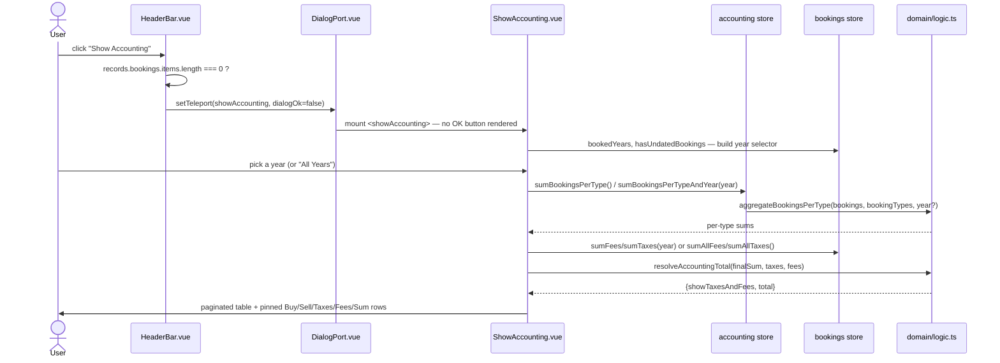

# Show Accounting — File-by-File Walkthrough

This document traces what happens, file by file, when a user opens the Accounting
dialog. Unlike every flow documented so far, there is no write at all — this dialog is
purely a read-and-aggregate view over data already in the Pinia stores, driven entirely
by `domain/logic.ts`'s pure aggregation functions.

## Quick file map

| Layer                  | File                                                                                        | Role                                                                                                            |
|------------------------|---------------------------------------------------------------------------------------------|-----------------------------------------------------------------------------------------------------------------|
| Entry point            | `/src/adapters/ui/views/HeaderBar.vue` (Home view)                                          | Renders the **Show Accounting** toolbar button                                                                  |
| Action wiring          | `/src/adapters/ui/composables/useHeaderBarActions.ts`                                       | Guards on `records.bookings.items.length` — "no bookings yet" is the actual precondition, not an active account |
| Dialog registration    | `/src/adapters/ui/plugins/components.ts`                                                    | Maps `"showAccounting"` to `ShowAccounting.vue`, opened with `dialogOk: false`                                  |
| Dialog component       | `/src/adapters/ui/components/dialogs/ShowAccounting.vue`                                    | Year selector + a paginated table with pinned summary rows; all computation is local `computed()`s              |
| Aggregation (per type) | `/src/adapters/ui/stores/accounting.ts` (`sumBookingsPerType`, `sumBookingsPerTypeAndYear`) | Thin store wrappers over `domain/logic.ts`                                                                      |
| Aggregation (domain)   | `/src/domain/logic.ts` (`aggregateBookingsPerType`, `resolveAccountingTotal`)               | Pure functions: per-type sums, and the Sum-row/Taxes-Fees visibility rule                                       |
| Fee/tax totals         | `/src/adapters/ui/stores/bookings.ts` (`sumFees`, `sumTaxes`, `sumAllFees`, `sumAllTaxes`)  | Read directly off each booking's own signed fee/tax fields, not off type labels                                 |
| Year list              | `/src/adapters/ui/stores/bookings.ts` (`bookedYears`, `hasUndatedBookings`)                 | Which years the selector offers, plus whether an "Undated" entry is needed                                      |

## Step by step

### 1. Opening the dialog — `dialogOk: false`

`HeaderBar.vue`'s **Show Accounting** dispatches to `useHeaderBarActions.ts`'s
`showAccounting`:

```ts
showAccounting: async () => {
    if (records.bookings.items.length === 0) {
        await alertAdapter.feedbackInfo(t("views.headerBar.infoTitle"), t("views.headerBar.messages.noBooking"));
    } else {
        openDialog("showAccounting", false);
    }
},
```

The guard is a booking count, not `hasActiveAccount` — an account with zero bookings has
nothing to aggregate regardless of whether it's the active one. `openDialog(..., false)`
passes `dialogOk: false`, which `DialogPort.vue` reads to skip rendering the OK button
entirely (see the `v-if="runtime.dialogOk"` on its OK `v-btn`) — this dialog is
read-only, so there is nothing to confirm; only the Cancel/close button applies.

### 2. The year selector

`selected` defaults to `COMPONENTS.DIALOGS.SHOW_ACCOUNTING.ALL_YEARS_ID`. `yearEntries`
builds the dropdown from `records.bookings.bookedYears` (a `Set<number>` of every year
that has at least one dated booking), prepending the "All Years" sentinel and — only when
`records.bookings.hasUndatedBookings` is true — appending a `DATE.UNDATED_YEAR` entry.
That conditional entry exists precisely so a database containing undated bookings (the
one way they can reach the store at all — see
[Import Database](import-database.md) §5 step 5) has *some* selection that reproduces the
"All Years" total; without it, an undated booking is counted by the all-time figure but
by no calendar year, and nothing in the selector could ever show where that difference
came from.

`getAccountData(year)` treats a `null` selection (Vuetify's `clearable` select emits
`null`, not `undefined`, when cleared) identically to the "All Years" sentinel, rather
than falling through to the per-year branch — where `aggregateBookingsPerType`'s truthy
year check would have silently returned all-time sums while `sumTaxes`/`sumFees`'s strict
`=== year` equality would have returned `0`, producing a total that mismatched its own
components.

### 3. Two separately-rendered row groups

The table body renders `accountEntries` — every booking type **except** Buy and Sell,
matched by `cRole` (not name), sorted alphabetically — as its normal paginated rows. Buy,
Sell, and the summary rows are deliberately **not** part of `:items` at all; they render
in the `body.append` slot instead (`summaryEntries`), so they appear on *every* page
regardless of pagination. They used to be appended to the same array the table paginated,
which meant a booking-type list longer than one page pushed the Sum row onto the last
page — the first page showed figures with no total, and the last showed a total with no
context.

`summaryEntries` is built from:

```ts
const {showTaxesAndFees, total} = resolveAccountingTotal(finalSum, taxes, fees);
```

`domain/logic.ts`'s `resolveAccountingTotal` is what decides both whether the Taxes/Fees
rows are shown *and* whether they're folded into the Sum — gated on the figures
themselves (`taxes !== 0 || fees !== 0`), **not** on `records.isDepot`. This matters
because `cWithDepot` can be switched off on an account that still carries Buy/Sell/
Dividend booking types and fee/tax-bearing bookings under them (toggling it off deletes
nothing — see [Edit Account](edit-account.md) §5) — gating on `isDepot` instead would let
that toggle change what this dialog shows without changing the figure the TitleBar's own
account balance displays (`calculateTotalSum`, which subtracts fees and taxes
unconditionally for every booking regardless of `isDepot`), producing two disagreeing
totals for the same account on screen at once.

### 4. The aggregation itself — `domain/logic.ts`

`aggregateBookingsPerType(bookings, bookingTypes, year?)` maps **1:1** over the
`bookingTypes` array it's given — the same store, same order, both in this dialog and in
`accounting.ts` — so `accountEntries`' `role: bookingTypes[i]?.cRole` lookup by array
index is sound only because both call sites iterate the identical array. For each type it
filters bookings by `cBookingTypeID` and (when a year is given) by `matchesBookingYear`,
using an **explicit `!== undefined` check** rather than a truthiness test — a
falsy-but-supplied year would otherwise silently mean "all years," the same
truthy-vs-nullish pitfall this codebase has hit on other `clearable` selects. Each type's
sum is `credit - debit` across its matched bookings, rounded to 2 decimals.

Fee/tax totals are **not** derived from `aggregateBookingsPerType` at all — they come
from `bookings.sumFees`/`sumTaxes` (per year) or `sumAllFees`/`sumAllTaxes` (all years),
reading each booking's own `cFee`/`cTax`/`cSoli`/`cSourceTax`/`cTransactionTax` fields
directly, independent of which booking type it's filed under.

### 5. No write, no usecase layer at all

Every other dialog documented in this series calls into `/src/app/usecases/*` for its
`onClickOk`. This one has no `onClickOk` beyond `defineExpose({title})` — there is
nothing to submit, and `dialogOk: false` means `DialogPort.vue` never even renders a
button that would call one. All calculations happen synchronously, in memory, from data
already loaded; opening this dialog issues no database query and calls no usecase.

## Sequence diagram



## Related documents

- [`/src/app/usecases/README.md`](/src/app/usecases/README.md) §7.1
- `/tests/e2e/dialog-actions.spec.ts` — `showAccounting: opens a read-only dialog with accounting figures, then closes`
