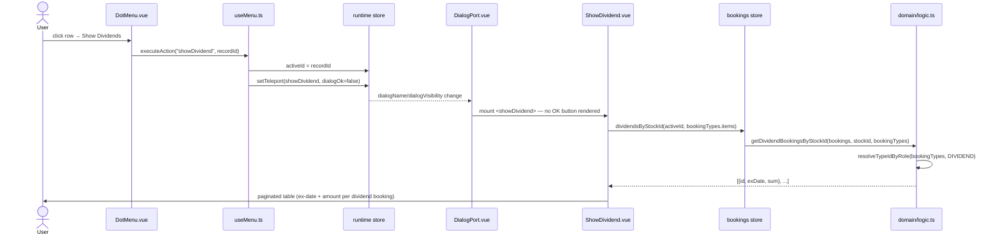

# Show Dividend — File-by-File Walkthrough

This document traces what happens, file by file, when a user opens the dividend overview
for a stock from its row menu on the Company view. Like [Show Accounting](show-accounting.md),
this is a read-only dialog with no usecase layer involvement — its only non-trivial part
is resolving *which* bookings count as dividends at all.

## Quick file map

| Layer                | File                                                                                   | Role                                                                                       |
|----------------------|----------------------------------------------------------------------------------------|--------------------------------------------------------------------------------------------|
| Entry point          | `/src/adapters/ui/components/DotMenu.vue` (row action menu)                            | Renders the **Show Dividends** row action on the CompanyContent stock table                |
| Action wiring        | `/src/adapters/ui/composables/useMenu.ts` (`useMenuAction`)                            | Dispatches `showDividend`, opens the dialog with `runtime.activeId` set to the clicked row |
| Dialog registration  | `/src/adapters/ui/plugins/components.ts`                                               | Maps `"showDividend"` to `ShowDividend.vue`, opened with `dialogOk: false`                 |
| Dialog component     | `/src/adapters/ui/components/dialogs/ShowDividend.vue`                                 | A paginated table over one stock's dividend bookings; no form, no `onClickOk`              |
| Aggregation (store)  | `/src/adapters/ui/stores/bookings.ts` (`dividendsByStockId`)                           | Thin wrapper over the domain function                                                      |
| Aggregation (domain) | `/src/domain/logic.ts` (`getDividendBookingsByStockId`, private `resolveTypeIdByRole`) | Resolves the account's Dividend-role type, filters bookings by stock + that type           |

## Step by step

### 1. Opening the dialog — from a row, not the header bar

The user opens a stock row's `DotMenu` and clicks **Show Dividends**. This reaches
`useMenu.ts`'s `executeAction`, which — same as every row action documented in this
series (see [Edit Stock](edit-stock.md) §1) — sets `runtime.activeId = recordId` before
dispatching:

```ts
async showDividend() {
    openDialog("showDividend", false);
},
```

`runtime.activeId` is the only channel carrying which stock this dialog is about —
`ShowDividend.vue` takes no prop and is instantiated with no arguments by `DialogPort.vue`
(`<component :is="runtime.dialogName"/>`), the same mechanism `UpdateBooking.vue`/
`UpdateStock.vue` rely on. `dialogOk: false` is passed here for the same reason
[Show Accounting](show-accounting.md) §1 documents: this is a read-only view, so
`DialogPort.vue` skips rendering the OK button entirely (`v-if="runtime.dialogOk"`) —
only Cancel/close applies.

### 2. The dialog — no form, no lookup guard

Unlike `UpdateBooking.vue`/`UpdateStock.vue`, `ShowDividend.vue` performs no
`records.stocks.getById(runtime.activeId)` lookup and has no "missing record" guard at
all. It doesn't need one: the id is only ever *passed through* to a pure aggregation
function (step 3), which simply returns an empty array for an id that resolves to
nothing — there is no form to silently corrupt into an insert-instead-of-update the way a
missing lookup would for [Edit Booking](edit-booking.md) or [Edit Stock](edit-stock.md).

```html
<v-data-table :items="records.bookings.dividendsByStockId(activeId, records.bookingTypes.items)" ... />
```

`activeId` is read once via `storeToRefs(useRuntimeStore())`, so the table stays reactive
to it for as long as the dialog is mounted — though nothing in this flow ever changes it
while the dialog is open.

### 3. Resolving "dividend" — by role, not by name or a fixed id

`useBookingsStore.dividendsByStockId` forwards straight to `domain/logic.ts`'s
`getDividendBookingsByStockId`:

```ts
export function getDividendBookingsByStockId(
    bookings: BookingDb[],
    stockId: number,
    bookingTypes: Pick<BookingTypeDb, "cID" | "cRole">[]
): {id: number; exDate: string; sum: number}[] {
    const dividendTypeId = resolveTypeIdByRole(bookingTypes, BOOKING_TYPE_ROLE.DIVIDEND);
    return bookings
        .filter((entry) => entry.cStockID === stockId && entry.cBookingTypeID === dividendTypeId)
        .map((entry) => ({id: entry.cID, exDate: entry.cExDate, sum: entry.cCredit}));
}
```

`resolveTypeIdByRole` (private to `logic.ts`, the same helper
`calculatePortfolioByStockId`/`calculateInvestByStockId` use to resolve Buy/Sell) finds
the account's booking type whose `cRole` is `DIVIDEND` — never by name and never by a
fixed id. This is what makes the dialog keep working correctly after a type named
"Dividend" is renamed (e.g. to "Dividende") through [Edit Booking Type](edit-booking-type.md):
the role, not the label, is what every calculation in this app keys off. Each result row
carries the booking's `cExDate` (labeled "Ex-date"/"Ex-Tag" in the table — a comment in
`logic.ts` notes the field used to be misleadingly named `year` despite carrying the full
date) and `cCredit` as the dividend amount received.

### 4. Rendering — a defensive guard around a genuinely throwing formatter

The template guards each row's date cell:

```html
<template v-if="isValidISODate(item.exDate)">
    {{ d(utcDate(item.exDate), "short") }}
</template>
```

This guard is load-bearing, not decorative. `item.exDate` is the booking's raw `cExDate`
string, and passing an unparseable one straight to vue-i18n's `d()` routes it through
`@intlify`'s `parseDateTimeArgs`, which **throws** (`INVALID_ISO_DATE_ARGUMENT`) rather
than degrading gracefully. `validateBooking`'s `normalizeDate` deliberately yields `""`
for a missing or malformed date instead of guessing "today" — so a dividend booking
imported from a backup with no ex-date is a real, reachable case, and without this guard
it took the whole dialog down with an uncaught render-function exception. Converting
first isn't suffient either: `utcDate("")` returns an `Invalid Date`, and
`Intl.DateTimeFormat.format()` throws a `RangeError` on that too — the check has to
happen *before* any conversion is attempted, not after.

### 5. What this dialog does **not** compute

`/src/app/usecases/README.md`'s own workflow description for this dialog (§7.2) mentions
"calculates dividend yield = (total dividends / total invested)" — but no such
calculation exists anywhere in `ShowDividend.vue`, `dividendsByStockId`, or
`getDividendBookingsByStockId`. The dialog lists each dividend booking's ex-date and
amount and nothing else; there is no total row, no yield percentage, and no reference to
`calculateInvestByStockId` (the FIFO invested-amount function a yield calculation would
need) anywhere in this file. That line in the README predates this walkthrough and
describes a feature that either was never built or was since removed — a case worth
noting rather than repeating, since a doc asserting a wrong feature is worse than one
that says nothing.

## Sequence diagram



## Related documents

- [Edit Stock](edit-stock.md) — the same row-menu / `runtime.activeId` entry pattern
- [Show Accounting](show-accounting.md) — the same no-usecase, `dialogOk: false` read-only shape
- [Edit Booking Type](edit-booking-type.md) — why "Dividend" is resolved by role, not name
- [`/src/app/usecases/README.md`](/src/app/usecases/README.md) §7.2
- `/tests/e2e/dialog-actions.spec.ts` — `showDividend: opens the read-only dividend dialog for a stock, then closes`
  (the fixture has no dividend booking, so this exercises the empty-state path)
