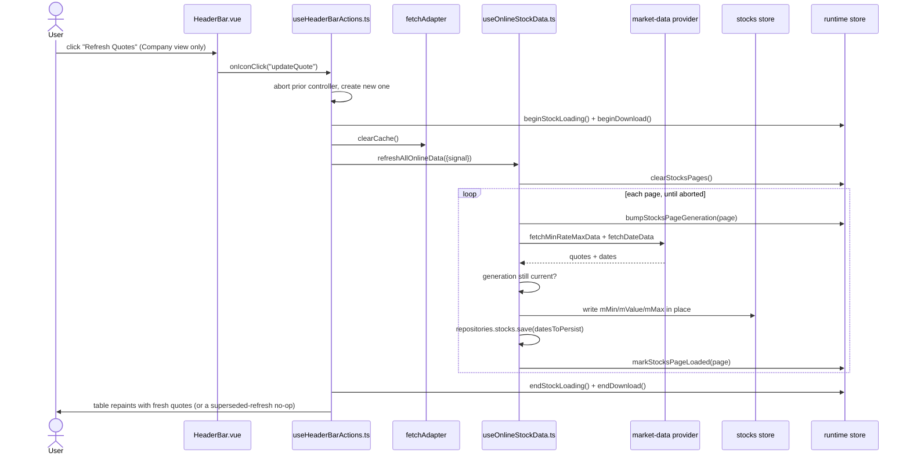

# Update Quote — File-by-File Walkthrough

This document traces what happens, file by file, when a user clicks the manual **Refresh
Quotes** button on the Company view. It is a force-refresh of every page's online market
data, sharing its fetch mechanics with the automatic load that already runs when
CompanyContent mounts — the manual trigger's job is cache invalidation, cancellation of
any prior in-flight refresh, and sweeping *every* page rather than just the one on
screen.

See also: [Add Stock](add-stock.md) §6 — the same `useOnlineStockData` fetch path,
triggered for one stock instead of every page.

## Quick file map

| Layer               | File                                                                                                                         | Role                                                                                     |
|---------------------|------------------------------------------------------------------------------------------------------------------------------|------------------------------------------------------------------------------------------|
| Entry point         | `/src/adapters/ui/views/HeaderBar.vue` (Company view)                                                                        | Renders the **Refresh Quotes** toolbar button                                            |
| Action wiring       | `/src/adapters/ui/composables/useHeaderBarActions.ts`                                                                        | Owns the `AbortController` supersession, loading flags, cache clear, and error reporting |
| Fetch orchestration | `/src/adapters/ui/composables/useOnlineStockData.ts` (`refreshAllOnlineData`, `loadOnlineData`)                              | Invalidates every page's freshness marker, then re-fetches page by page                  |
| HTTP cache          | `/src/adapters/driven/fetch/...` (`fetchAdapter.clearCache`)                                                                 | Drops cached provider responses so a stale price can't survive the refresh               |
| Currency conversion | `/src/domain/logic.ts` (`resolveDisplayCurrency`)                                                                            | Resolves the active account's currency as the fetch's conversion target                  |
| Runtime state       | `/src/adapters/ui/stores/runtime.ts` (`beginStockLoading`/`endStockLoading`, `beginDownload`/`endDownload`, page generation) | Ref-counted loading flags shared with every other caller of the fetch composable         |

## Step by step

### 1. Clicking the button — only visible on the Company view

`HeaderBar.vue` renders the **Refresh Quotes** icon only `v-if="runtime.getCurrentView
=== COMPANY"`. Clicking it dispatches to `useHeaderBarActions.ts`'s `updateQuote`:

```ts
updateQuote: async () => {
    updateQuoteController?.abort();
    const controller = new AbortController();
    updateQuoteController = controller;
    runtime.beginStockLoading();
    runtime.beginDownload();
    try {
        fetchAdapter.clearCache();
        await refreshAllOnlineData({signal: controller.signal});
    } catch (err) {
        if (controller.signal.aborted) return;
        await alertAdapter.feedbackError(t("views.headerBar.infoTitle"), err, {data: {context: "UPDATE_QUOTE"}, logLevel: "error"});
    } finally {
        if (updateQuoteController === controller) updateQuoteController = null;
        runtime.endStockLoading();
        runtime.endDownload();
    }
},
```

Unlike every dialog-opening action documented elsewhere in this series, this handler runs **directly** — there is no
`openDialog` call and no `DialogPort` teleport involved at
all. `"updateQuote"` is not registered in `/src/adapters/ui/plugins/components.ts`; the
button triggers the whole refresh in place.

### 2. Superseding a prior in-flight refresh

A **module-level** `updateQuoteController` (scoped to the composable instance, living
across repeated clicks) is aborted and replaced on every click:

```ts
updateQuoteController?.abort();
const controller = new AbortController();
updateQuoteController = controller;
```

A second click while a refresh is still running cancels the first rather than running two
concurrent sweeps. The `catch` explicitly treats `controller.signal.aborted` as a
non-failure — a refresh superseded by a newer click is not an error, so no
`feedbackError` is shown for it. `onUnmounted` also aborts the controller, so navigating
away from the Company view cancels an in-flight refresh rather than leaving it to
complete against an unmounted view.

### 3. Ref-counted loading flags — shared with every other caller

`runtime.beginStockLoading()`/`beginDownload()` and their `end*` counterparts are **ref-counted**, not booleans — a
comment in the finally block notes this explicitly:
"other in-flight callers (e.g. a per-row quote update) may still be holding the shared
flags up." [Add Stock](add-stock.md) §6's post-save refresh brackets its own call with the
identical pair, and both can be in flight at once without one's completion prematurely
clearing the loading indicator for the other.

### 4. Cache clear, then a full page-by-page sweep

`fetchAdapter.clearCache()` drops every cached HTTP response — quote data (1-minute TTL),
meeting/date data and exchange rates (5-minute TTL), and the meeting/date lookup-failure
backoff (10-minute TTL) — so nothing about this manual refresh can be served from a cache
entry that predates the click.

`refreshAllOnlineData` (`useOnlineStockData.ts`):

```ts
async function refreshAllOnlineData(options?: {signal?: AbortSignal}): Promise<void> {
    const totalPages = Math.ceil(portfolio.active.length / settings.stocksPerPage);
    runtime.clearStocksPages();
    for (let page = 1; page <= totalPages; page++) {
        if (options?.signal?.aborted) break;
        await loadOnlineData(page, options);
    }
}
```

This invalidates every page's freshness marker (`clearStocksPages`) and then walks **every** page sequentially, not just
the one currently on screen — unlike
`refreshOnlineData` (singular), which invalidates and reloads one named page for a
single-stock refresh (see [Add Stock](add-stock.md) §6). The loop checks the abort signal
between pages, so a superseding click stops the sweep at the next page boundary rather
than continuing to fetch pages nobody will see.

### 5. `loadOnlineData` — the shared fetch mechanics

Each page's fetch, inside `loadOnlineData`, is identical regardless of caller (automatic mount-time load, per-page force
refresh, or this full sweep):

1. **Page generation claim** (`runtime.bumpStocksPageGeneration(page)`), taken *before*
   any `await`, so a newer call for the same page — from this sweep or a different
   caller — can invalidate this call's eventual write-back rather than racing it.
2. **Resolve which stocks to fetch** — `resolvePageStocks`, using a positional slice of
   `portfolio.active` here (this sweep covers every page anyway, so the slice's
   sort-order fragility documented in [Add Stock](add-stock.md) §6 doesn't matter for
   this particular caller).
3. **Drop stocks with no ISIN** before building the request — an empty ISIN would
   otherwise hit the provider's search endpoint with a blank query, fail to parse, and
   raise a non-dismissing failure alert on every future refresh of that page.
4. **Fetch price and date data in parallel** (`fetchMinRateMaxData`, `fetchDateData`),
   then re-check the page generation is still current before writing anything back — a
   newer call may have superseded this one while the request was in flight, including
   during the failed-ISIN alert's own `await`.
5. **Convert currency**: `resolveDisplayCurrency(accounts.items, settings.activeAccountId,
   settings.currency)` resolves the **active account's** currency as the conversion
   target — never derived from the browser's locale, since a user's UI language says
   nothing about what currency their holdings are actually denominated in.
6. **Write `mMin`/`mValue`/`mMax` in place** onto the stocks store (not `mChange`, which
   `portfolio.active` derives fresh on every read instead — see the comment in
   `useOnlineStockData.ts` for why writing it here would let two independent formulas
   disagree).
7. **Persist fetched meeting/quarter dates and the `cAskDates` throttle** via
   `repositories.stocks.save()` — these three are real DB columns, unlike the RAM-only
   `m*` price fields, so they must survive a reload; a persistence failure here is logged
   but does not fail the refresh, since the price data already landed successfully.
8. `runtime.markStocksPageLoaded(page)` marks the page fresh, regardless of whether every
   individual fetch within it succeeded.

## Sequence diagram



## Related documents

- [Add Stock](add-stock.md) §6 — the identical fetch path for a single just-added stock
- [`/src/app/usecases/README.md`](/src/app/usecases/README.md) §6.2, §6.4 (HTTP cache TTL table)
- `/tests/e2e/dialog-actions.spec.ts` —
  `updateQuote: manual refresh completes without errors when the provider is disabled`
